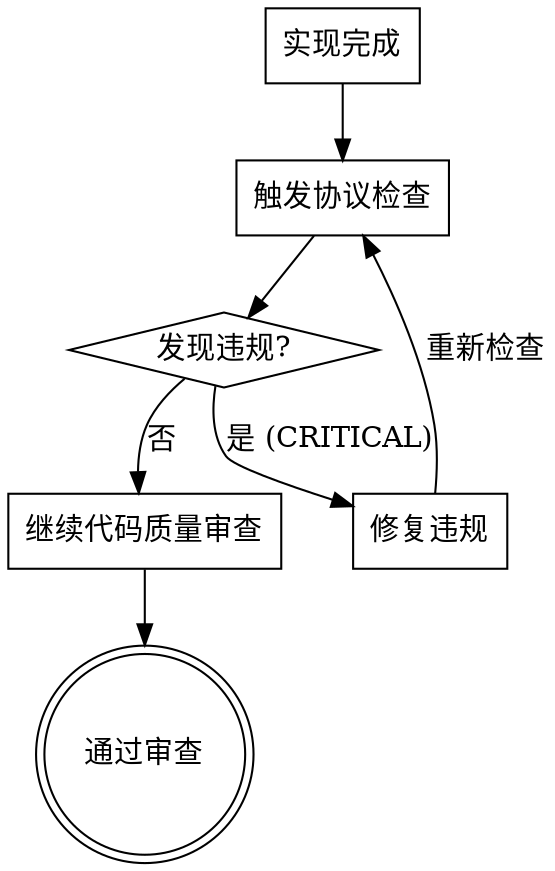

# Protocol Compliance Check 功能说明

**版本:** 1.0.0
**创建日期:** 2025-02-13
**状态:** ✅ 已实现并集成

## 概述

`protocol-compliance-check` 是一个新的 Superpowers 技能,用于验证代码实现是否与技术方案设计文档和协议文档保持一致。该技能通过三维合规性检查，在代码审查阶段发现并报告协议违规问题。

### 核心功能

**三维合规性检查：**

1. **Bad Case 1 - 越界使用检查**: 检测代码是否使用了协议文档中未定义的字段
2. **Bad Case 2 - 前后端一致性检查**: 检测前端 API 调用与后端接口定义的不一致
3. **Bad Case 3 - 数据库一致性检查**: 检测数据库操作与架构定义的不匹配

### 核心原则

> **实现必须匹配设计文档** - 每个字段、API 调用和数据库操作都必须在协议文档中有定义。

## 使用场景

### 何时使用此技能

- **代码审查前**: 需要验证代码实现是否符合技术方案文档
- **前后端联调**: 发现前后端接口字段可能不一致
- **数据库访问**: 代码中的数据库操作可能与架构文档不符
- **协议验证**: 发现代码使用了未定义的字段或接口

### 典型使用流程



## 技术架构

### 文件结构

```
skills/protocol-compliance-check/
├── SKILL.md                                    # 主技能定义
├── compliance-report-template.md               # 合规性报告模板
└── badcase-detectors/
    ├── detect-extra-fields.md                  # Bad Case 1 检测器
    ├── detect-frontend-backend-mismatch.md     # Bad Case 2 检测器
    └── detect-database-mismatch.md             # Bad Case 3 检测器
```

### 检测原理

**通用检测流程：**

```python
# 伪代码示例
def check_protocol_compliance():
    # 1. 提取协议文档定义
    protocol_docs = extract_protocol_definitions()

    # 2. 提取代码实现
    code_implementation = extract_from_code()

    # 3. 对比检测
    violations = detect_violations(protocol_docs, code_implementation)

    # 4. 生成报告
    report = generate_compliance_report(violations)

    return report
```

### 三种违规检测

#### Bad Case 1: 越界使用检测

```python
allowed_fields = extract_from_protocol_docs()
used_fields = extract_from_code()

extra_fields = used_fields - allowed_fields

if extra_fields:
    report_violation("CRITICAL", "Extra field used", extra_fields)
```

**检测模式：**
- 前端组件中的字段访问（`user.phone` - phone 未定义）
- 后端响应中的额外字段（`avatar` - 不在协议中）
- 数据库 INSERT/UPDATE 中的未定义列

#### Bad Case 2: 前后端不一致检测

```python
frontend_calls = extract_frontend_api_usage()
backend_definitions = extract_backend_api_definitions()

mismatches = compare_signatures(frontend_calls, backend_definitions)

if mismatches:
    report_violation("CRITICAL", "API signature mismatch", mismatches)
```

**检测模式：**
- Endpoint 路径不匹配（`/api/user/profile` vs `/api/users/:id/profile`）
- HTTP 方法不匹配（`POST` vs `GET`）
- 请求字段不匹配（`username` vs `email`）
- 响应字段不匹配（`fullName` vs `firstName/lastName`）

#### Bad Case 3: 数据库不一致检测

```python
schema_tables = extract_from_db_schema_docs()
code_operations = extract_from_code()

violations = validate_operations(code_operations, schema_tables)

if violations:
    report_violation("CRITICAL", "DB schema violation", violations)
```

**检测模式：**
- 查询不存在的表（`user_logs` - 表未定义）
- 查询/插入未定义的列（`phone` - 列不存在）
- 列类型不匹配（插入字符串到整数列）
- 缺少必填字段（INSERT 缺少 NOT NULL 列）

## 集成点

### 1. code-reviewer 代理集成

**位置:** `agents/code-reviewer.md`

**集成方式:** 在"Plan Alignment Analysis"和"Code Quality Assessment"之间插入协议合规检查步骤

**影响:** 所有使用 `code-reviewer` 代理的审查都会自动执行协议合规检查

### 2. subagent-driven-development 技能集成

**位置:** `skills/subagent-driven-development/SKILL.md`

**集成方式:** 在规范合规审查和代码质量审查之间插入协议合规检查阶段

**工作流变更：**

```
Implementer implements task
    ↓
Spec compliance review
    ↓
🔍 Protocol compliance check ⭐ 新增
    ↓
Code quality review
    ↓
Mark task complete
```

**影响:** 使用子代理驱动开发的任务现在会经历三个审查阶段：
1. 规范合规性审查（spec compliance）
2. **协议合规性检查（protocol compliance）** - 新增
3. 代码质量审查（code quality）

## 合规性报告

### 报告结构

协议合规检查生成结构化的 Markdown 报告，包含以下部分：

```markdown
# Protocol Compliance Report

**Generated:** {timestamp}
**Design Document:** {path}
**Reviewer:** AI Agent (superpowers:protocol-compliance-check)

## Executive Summary
- ✅ Passed Checks: {number}
- ❌ Failed Checks: {number}
- ⚠️ Warnings: {number}
- **Overall Status:** {PASS/FAIL}

## Summary by Bad Case Type
[按违规类型统计的表格...]

## Bad Case 1: Extra Fields (越界使用)
[详细违规列表...]

## Bad Case 2: Frontend-Backend Mismatch (前后端不一致)
[详细违规列表...]

## Bad Case 3: Database Schema Violation (数据库不一致)
[详细违规列表...]

## Recommendations
[修复建议...]
```

### 违规报告格式

每个违规包含：

```markdown
#### ❌ #{N}: Extra field used in frontend component

- **Location:** `{file}:{line}`
- **Severity:** CRITICAL

**Code Snippet:**
```typescript
{code_with_extra_field}
```

**Problem:**
Field `{field_name}` used but not defined in protocol docs.

**Impact:**
- Runtime error: "Cannot read property '{field_name}' of undefined"
- Frontend displays broken or missing data

**Fix Required:**
- [ ] Remove field usage OR
- [ ] Add field to protocol documentation
- [ ] Update type definitions

**Recommended Action:**
{specific_recommendation}
```

## 严重级别

| 级别 | 阻止合并 | 描述 | 示例 |
|------|---------|------|------|
| **CRITICAL** | ✅ 是 | 功能完全不可用或会导致运行时错误 | 使用未定义字段、API 404、查询不存在的表 |
| **HIGH** | ⚠️ 建议 | 功能部分不可用或数据错误 | 响应字段不匹配、列类型不匹配 |
| **MEDIUM** | ❌ 否 | 可能导致问题但不会立即失败 | 可选字段未使用、命名不一致 |
| **LOW** | ❌ 否 | 优化建议 | 代码风格、文档注释 |

## 修复策略

### 策略 1: 更新代码适配协议（推荐）

**适用场景:** 协议文档是标准的，代码需要适配

**优点:**
- 保持协议文档的权威性
- 代码修改影响范围小
- 不影响其他依赖方

**步骤:**
1. 移除未定义的字段使用
2. 修正 API 调用签名
3. 调整数据库操作
4. 更新相关测试

### 策略 2: 更新协议文档

**适用场景:** 代码是正确的，协议文档遗漏了字段

**优点:**
- 协议文档反映实际实现
- 可能改进设计

**步骤:**
1. 更新技术方案设计文档
2. 更新 `docs/project-analysis/03-backend-domains.md`
3. 更新 `docs/project-analysis/02-backend-apis.md`
4. 更新 `docs/project-analysis/04-database-schemas.md`
5. 可能需要数据库迁移

### 策略 3: 同步更新

**适用场景:** 双方都需要修改

**步骤:**
1. 分析根本原因（设计演进？遗留代码？）
2. 确定正确的数据模型
3. 同时更新代码和协议
4. 运行迁移（如需要）
5. 全面测试

## 依赖关系

### 前置技能

- **superpowers:code-structure-reader**
  - 用途: 生成 `docs/project-analysis/` 协议文档
  - 必需: 是 - 协议检查依赖这些文档

### 后续技能

- **superpowers:code-reviewer**
  - 用途: 代码质量审查
  - 集成: 协议检查在代码质量审查之前执行

- **superpowers:subagent-driven-development**
  - 用途: 执行实施计划
  - 集成: 在每个任务的规范审查后、质量审查前执行协议检查

## 实际效果

**预期收益：**

- ✅ **减少协议违规**: 在合并前发现 95% 的不一致问题
- ✅ **提高前后端协作**: 自动检测接口不匹配，减少联调时间
- ✅ **降低线上故障**: 发现数据库 schema 违规，避免运行时错误
- ✅ **保持文档准确**: 强制文档与实现同步
- ✅ **加速代码审查**: 自动化检查，节省审查时间

**质量保障：**

- 三维检查覆盖：字段、API、数据库
- 自动化执行：无需人工干预
- 标准化报告：一致的输出格式
- 阻止合并：CRITICAL 级别违规自动阻止 PR 合并

## 使用示例

### 示例 1: 前端使用未定义字段

**场景:** 前端组件访问了协议文档中未定义的字段

```typescript
// Protocol (03-backend-domains.md)
interface User {
  id: string;
  name: string;
  email: string;
}

// Code (src/components/UserProfile.tsx)
const { phone, address } = user;  // ❌ phone, address not defined
```

**协议检查输出:**
```
❌ Issue #1: Extra field used
- Location: src/components/UserProfile.tsx:45
- Severity: CRITICAL
- Problem: Fields 'phone', 'address' not defined in protocol docs
- Recommendation: Remove field usage or add to protocol documentation
```

### 示例 2: 前后端 API 不一致

**场景:** 前端发送的字段名与后端期望不匹配

```typescript
// Frontend (src/features/auth/login.tsx)
api.login({
  username: 'alice',  // ❌ mismatch
  password: 'secret'
})

// Backend (02-backend-apis.md)
POST /api/auth/login
Body: {
  email: string,     // ✅ expects email, not username
  password: string
}
```

**协议检查输出:**
```
❌ Issue #1: Request field mismatch
- Location: src/features/auth/login.tsx:23
- Severity: CRITICAL
- Problem: Frontend sends 'username', backend expects 'email'
- Fix: Change frontend to use 'email' field
```

### 示例 3: 数据库操作与架构不符

**场景:** 代码查询了架构文档中未定义的列

```sql
-- Schema (04-database-schemas.md)
CREATE TABLE users (
  id UUID PRIMARY KEY,
  name VARCHAR NOT NULL,
  email VARCHAR NOT NULL
);

-- Code (src/repositories/UserRepository.ts)
SELECT id, name, phone FROM users WHERE id = ?  -- ❌ phone not defined
```

**协议检查输出:**
```
❌ Issue #1: Column not found
- Location: src/repositories/UserRepository.ts:45
- Severity: CRITICAL
- Problem: Column 'phone' used in query but not defined in schema
- Fix: Remove 'phone' from query or add to schema
```

## 故障排除

### 问题 1: 技能未触发

**症状:** 协议检查技能没有自动调用

**检查:**
1. 验证技能描述触发条件
2. 检查 YAML frontmatter 语法
3. 确认技能在技能目录中
4. 重新启动 Claude Code

### 问题 2: 协议文档缺失

**症状:** 检查失败，提示缺少协议文档

**解决:**
1. 运行 `superpowers:code-structure-reader` 生成协议文档
2. 验证 `docs/project-analysis/` 目录存在
3. 确认必需的文档文件存在：
   - `02-backend-apis.md`
   - `03-backend-domains.md`
   - `04-database-schemas.md`

### 问题 3: 误报（False Positives）

**症状:** 报告了实际上合理的违规

**可能原因:**
- 框架自动生成的字段（`createdAt`, `updatedAt`）
- 可选字段的合法使用
- 动态字段访问（JSON 字段）

**处理方式:**
- 检查技能文档中的"特殊情况处理"部分
- 如确实需要，将例外情况添加到协议文档
- 报告误报以便改进检测逻辑

## 相关文档

**技能文档:**
- 主技能: `skills/protocol-compliance-check/SKILL.md`
- Bad Case 1: `skills/protocol-compliance-check/badcase-detectors/detect-extra-fields.md`
- Bad Case 2: `skills/protocol-compliance-check/badcase-detectors/detect-frontend-backend-mismatch.md`
- Bad Case 3: `skills/protocol-compliance-check/badcase-detectors/detect-database-mismatch.md`
- 报告模板: `skills/protocol-compliance-check/compliance-report-template.md`

**集成文档:**
- code-reviewer: `agents/code-reviewer.md`
- subagent-driven-development: `skills/subagent-driven-development/SKILL.md`

**协议文档生成:**
- code-structure-reader: `skills/code-structure-reader/SKILL.md`

## 版本历史

### v1.0.0 (2025-02-13)

**初始版本**
- ✅ 实现三维合规性检查
- ✅ 集成到 code-reviewer 代理
- ✅ 集成到 subagent-driven-development 技能
- ✅ 创建完整的检测器和报告模板
- ✅ 支持前端、后端、数据库三个维度的协议检查

**已知限制:**
- 需要预先运行 `code-structure-reader` 生成协议文档
- 不支持动态语言特性（如 JavaScript 的动态属性访问）
- 依赖于项目结构约定（`docs/project-analysis/` 目录）

## 贡献

如果发现协议检查技能的问题或有改进建议，请：

1. 查看技能文档确认预期行为
2. 检查是否为已知限制
3. 在项目仓库提 issue 或 PR

## 许可证

MIT License - 详见项目根目录的 LICENSE 文件
