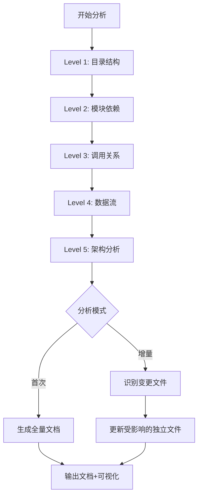

# Code Structure Reader - 设计文档 v3 (最终版)

**创建日期**: 2025-02-11
**版本**: 3.0 (方案A: 11个文件优化版)
**状态**: ✅ 用户已确认

---

## Part 1: 业务需求

### 1.1 核心价值主张

**Code Structure Reader** 是一个深度代码分析和智能文档生成技能,帮助团队:
- **新人快速onboarding**: 系统化理解项目架构,缩短上手时间
- **避免重复开发**: 识别现有能力和组件,支持技术方案设计决策
- **提升代码审查质量**: 理解模块依赖和调用关系
- **技术债务可视化**: 为重构提供数据支撑

### 1.2 使用场景

#### 场景1: 新人入职
**触发条件**: 新团队成员加入项目
**用户痛点**:
- 项目结构复杂,不知道从哪开始理解
- 文档过时或不完整
- 缺乏系统性学习路径

**期望输出**:
- 目录结构树状图
- 核心模块说明和职责
- 技术栈总览
- 推荐学习路径(按依赖顺序)

#### 场景2: 技术方案设计
**触发条件**: 需求评审后开始设计技术方案
**用户痛点**:
- 不知道项目已有类似功能
- 重复开发相同组件
- 不清楚如何集成到现有架构

**期望输出**:
- 现有组件/接口清单(可复用能力)
- 领域模型和实体关系
- API接口目录(带参数说明)
- 数据库表结构(带字段说明)
- 依赖关系图(避免循环依赖)

#### 场景3: 代码审查
**触发条件**: PR提交后审查代码
**用户痛点**:
- 不清楚改动对其他模块的影响
- 难以识别架构层面的风险

**期望输出**:
- 影响范围分析(哪些模块依赖了变更点)
- 调用链可视化(上下游关系)
- 潜在风险点提示

#### 场景4: 技术债务分析
**触发条件**: 定期代码健康检查
**用户痛点**:
- 技术债务难以量化
- 重构优先级不明确
- 缺乏数据支撑

**期望输出**:
- 代码复杂度热力图
- 循环依赖报告
- 重复代码识别
- 违反架构模式的位置
- 重构建议(带优先级)

### 1.3 核心差异化

与现有技能(codebase-documenter、codebase-summary)的对比:

| 维度 | 现有技能 | Code Structure Reader v3 |
|------|-----------|-------------------------|
| **分析深度** | Level 1-2(目录+基础依赖) | Level 1-5全覆盖(含调用链+数据流+架构) |
| **文档组织** | 单一文档或按文件 | 按环节拆分(11个独立文件) ⭐ |
| **更新机制** | 手动全量更新 | 增量更新+自动同步 |
| **可视化** | 基础树状图 | 组件布局图+依赖图+调用链图+架构图 |
| **交互性** | 静态文档 | 交互式智能索引 ⭐ |
| **技术栈** | 通用 | 针对性分析(前端/后端特有模式) |
| **本地化** | 英文为主 | 中文友好 |
| **开发指南** | ❌ 无 | ✅ 06-dev-guide.md(启动/构建/调试) |
| **依赖管理** | 基础列表 | ✅ 05-third-party-deps.md(含安全审计) |
| **测试策略** | ❌ 无 | ✅ 09-testing-strategy.md(覆盖率+工具链) |
| **安全扫描** | ❌ 无 | ✅ 10-quality-reports.md(含安全+技术债务) |
| **问答入口** | ❌ 无 | ✅ 11-interaction-index.md(智能导航) |

**v3版本核心优化**:
- ✅ 从14个文件精简到11个文件(-21%)
- ✅ 合并相关内容,减少维护成本
- ✅ 新增交互式索引,降低学习曲线

---

## Part 2A: 后端技术设计

### 2.1 技能类型

**Type**: Reference + Technique 混合型

- **Reference**: 代码分析方法和模式识别参考
- **Technique**: 具体的分析步骤和工具使用流程

### 2.2 核心分析流程



### 2.3 优化后的文件组织结构 (11个文件)

```
docs/project-analysis/
├── 00-overview.md              # 🏠 项目总入口
├── 01-frontend-components.md    # 🎨 前端组件清单
├── 02-backend-apis.md          # 🔌 API接口目录
├── 03-backend-domains.md       # 🏢 领域模型说明
├── 04-database-schemas.md      # 🗄️ 数据库表结构
├── 05-third-party-deps.md      # 📦 第三方依赖清单
├── 06-dev-guide.md            # 🚀 开发指南(启动/构建/调试)
├── 07-code-relations.md       # 🔗 代码关系全景(依赖+调用+数据流) ⭐合并
├── 08-architecture-patterns.md # 🏗️ 架构模式分析
├── 09-testing-strategy.md      # 🧪 测试策略
├── 10-quality-reports.md       # 📊 质量&安全报告(技术债务+安全风险) ⭐合并
└── 11-interaction-index.md    # 💬 交互式问答索引 ⭐新增
```

**文件合并说明**:
- **07-code-relations.md**: 合并了原 07-dependencies + 08-call-chains + 09-data-flows
- **10-quality-reports.md**: 合并了原 12-tech-debts + 13-security-risks

**优势**:
1. **语义聚合**: 相关内容在同一文件,避免跳转
2. **维护简化**: 修改代码时,更新3个关联文档即可
3. **全局视角**: 技术债务和安全风险统一考虑,便于重构决策
4. **新增交互**: 11-interaction-index.md 作为问答入口,降低学习曲线

---

## Part 3: 跨领域关注点

### 3.1 增量更新机制 (已确认)

**智能决策规则** (用户已认可):
```bash
变更文件数 < 10个  → 增量更新受影响的文件
变更文件数 ≥ 10个  → 全量重新分析
```

### 3.2 增量更新映射表

| 变更类型 | 自动更新的文件 |
|----------|-----------------|
| 修改前端组件 | `01-frontend-components.md` |
| 修改API路由 | `02-backend-apis.md` + `07-code-relations.md` |
| 修改领域逻辑 | `03-backend-domains.md` + `07-code-relations.md` |
| 修改数据库/模型 | `04-database-schemas.md` |
| 修改package.json | `05-third-party-deps.md` + `10-quality-reports.md` |
| 修改配置/脚本 | `06-dev-guide.md` |
| **修改代码逻辑** | **`07-code-relations.md`** (3合1,统一更新) |
| 修改测试文件 | `09-testing-strategy.md` |
| 架构调整 | `08-architecture-patterns.md` |
| 质量/安全问题 | `10-quality-reports.md` (2合1,统一视角) |

---

## Part 4: 实施优先级 (已确认)

### Phase 1: MVP (Minimum Viable Product)

**目标**: 快速交付核心价值

**功能范围**:
- ✅ Level 1: 目录结构分析
- ✅ Level 2: 模块依赖分析
- ✅ 生成核心文档文件(00-06)
- ✅ **新增**: 07-code-relations.md (基础依赖关系)
- ✅ 基础可视化(Mermaid树状图)
- ✅ **新增**: 06-dev-guide.md (新人快速上手)

**预期交付时间**: 1-2周

**核心价值**:
- ✅ 新人能在30分钟内启动项目
- ✅ 目录和依赖关系清晰
- ✅ 有明确的开发入口

---

### Phase 2: 核心功能

**目标**: 深入分析能力

**功能范围**:
- ✅ Level 3: 调用关系分析
- ✅ Level 4: 数据流分析
- ✅ 技术栈自动识别
- ✅ 第三方依赖清单(05-third-party-deps.md)
- ✅ 依赖关系图更新(扩展07-code-relations.md)
- ✅ **新增**: 11-interaction-index.md (交互式索引)

**预期交付时间**: +2-3周

**核心价值**:
- ✅ 理解完整调用链
- ✅ 知道依赖的安全风险
- ✅ 能快速定位功能(问答索引)

---

### Phase 3: 高级分析

**目标**: 智能决策支持

**功能范围**:
- ✅ Level 5: 架构模式识别
- ✅ 循环依赖检测
- ✅ 测试策略(09-testing-strategy.md)
- ✅ 技术债务(10-quality-reports.md前半部分)
- ✅ 增量更新机制

**预期交付时间**: +2-3周

**核心价值**:
- ✅ 架构可视化
- ✅ 测试覆盖率透明
- ✅ 技术债务量化
- ✅ 增量更新节省时间

---

### Phase 4: 增强功能

**目标**: 生产就绪

**功能范围**:
- ✅ 安全风险扫描(10-quality-reports.md后半部分)
- ✅ Graphviz复杂图表
- ✅ 性能优化(并行处理)
- ✅ 多语言支持(Java/Go/Rust)
- ✅ Web Dashboard(可选)

**预期交付时间**: +1-2周

**核心价值**:
- ✅ 主动发现安全问题
- ✅ 满足安全审计要求
- ✅ 大型项目性能可接受

---

## Part 5: 成功标准

### 5.1 功能性

- ✅ 能分析常见技术栈项目(JavaScript/Python/Java)
- ✅ 输出结构化、可读性强的11个文档
- ✅ 生成准确的依赖关系图
- ✅ 识别常见的架构模式
- ✅ 提供交互式问答索引

### 5.2 非功能性

- ✅ 中型项目(<500文件)分析时间 < 5分钟
- ✅ 大型项目(<2000文件)分析时间 < 20分钟
- ✅ 增量更新时间 < 30秒(增量模式)
- ✅ 内存占用 < 2GB

### 5.3 用户体验

- ✅ 新人能在30分钟内理解项目概貌
- ✅ 能快速定位到具体代码位置
- ✅ 输出内容对技术方案设计有帮助
- ✅ **新增**: 能通过问答索引快速找到答案

---

## 附录: 决策记录(ADR)

### ADR-001: 为什么从14个文件减少到11个?

**决策**: 合并相关内容,从14个文件减少到11个文件

**原因**:
1. **降低维护成本**: 相关内容在同一文件,更新时更方便
2. **提升阅读体验**: 减少文件间跳转
3. **保持合理粒度**: 11个文件仍然保持清晰的职责划分

**合并细节**:
- `07-code-relations.md` = 依赖 + 调用 + 数据流 (3合1)
- `10-quality-reports.md` = 技术债务 + 安全风险 (2合1)

**权衡**:
- ⚠️ 单个文件可能较长
  - **缓解**: 使用清晰的目录锚点和标题层级
- ✅ 总体维护成本降低

### ADR-002: 为什么新增交互式索引?

**决策**: 添加 11-interaction-index.md 作为问答入口

**原因**:
1. **降低学习曲线**: 新人不知道从哪里开始
2. **提高查找效率**: 常见问题快速解答
3. **统一入口**: 类似于项目的README,但更结构化

**实施方式**:
- 基于真实使用场景编写问答
- 链接到具体的文档章节
- 提供关键词检索建议

---

## 总结

**v3版本特点**:
1. ✅ **文件数优化**: 14 → 11 (-21%)
2. ✅ **内容聚合**: 3个文件合并,减少维护成本
3. ✅ **新增交互**: 问答索引,降低学习曲线
4. ✅ **保持优势**: 所有v2版本的增强特性都保留
5. ✅ **用户确认**: 实施优先级、更新规则均已确认

**下一步行动**:
1. ✅ 创建 SKILL.md 技能文档
2. ✅ 编写详细的实施计划 (2025-02-11-code-structure-reader-plan.md)
3. ✅ 按照 TDD 流程开发测试用例

---

**设计文档v3 - 完成**
