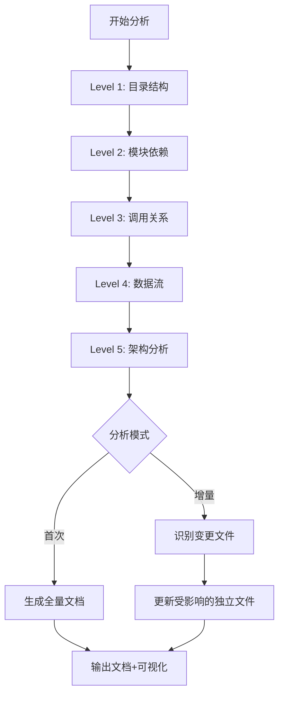
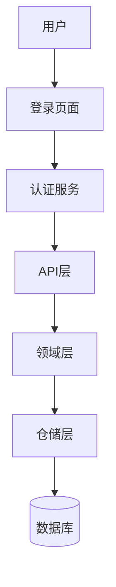

# Code Structure Reader - 设计文档

**创建日期**: 2025-02-11
**版本**: 1.0
**作者**: AI Assistant

---

## Part 1: 业务需求

### 1.1 核心价值主张

**Code Structure Reader** 是一个深度代码分析和智能文档生成技能,帮助团队:
- **新人快速onboarding**: 系统化理解项目架构,缩短上手时间
- **避免重复开发**: 识别现有能力和组件,支持技术方案设计决策
- **提升代码审查质量**: 理解模块依赖和调用关系
- **技术债务可视化**: 为重构提供数据支撑

### 1.2 使用场景

#### 场景1: 新人入职
**触发条件**: 新团队成员加入项目
**用户痛点**:
- 项目结构复杂,不知道从哪开始理解
- 文档过时或不完整
- 缺乏系统性学习路径

**期望输出**:
- 目录结构树状图
- 核心模块说明和职责
- 技术栈总览
- 推荐学习路径(按依赖顺序)

#### 场景2: 技术方案设计
**触发条件**: 需求评审后开始设计技术方案
**用户痛点**:
- 不知道项目已有类似功能
- 重复开发相同组件
- 不清楚如何集成到现有架构

**期望输出**:
- 现有组件/接口清单(可复用能力)
- 领域模型和实体关系
- API接口目录(带参数说明)
- 数据库表结构(带字段说明)
- 依赖关系图(避免循环依赖)

#### 场景3: 代码审查
**触发条件**: PR提交后审查代码
**用户痛点**:
- 不清楚改动对其他模块的影响
- 难以识别架构层面的风险

**期望输出**:
- 影响范围分析(哪些模块依赖了变更点)
- 调用链可视化(上下游关系)
- 潜在风险点提示

#### 场景4: 技术债务分析
**触发条件**: 定期代码健康检查
**用户痛点**:
- 技术债务难以量化
- 重构优先级不明确
- 缺乏数据支撑

**期望输出**:
- 代码复杂度热力图
- 循环依赖报告
- 重复代码识别
- 违反架构模式的位置
- 重构建议(带优先级)

### 1.3 核心差异化

与现有技能(codebase-documenter、codebase-summary)的对比:

| 维度 | 现有技能 | Code Structure Reader |
|------|-----------|---------------------|
| **分析深度** | Level 1-2(目录+基础依赖) | Level 1-5全覆盖(含调用链+数据流+架构) |
| **文档组织** | 单一文档或按文件 | 按环节拆分(13个独立文件) ⭐ |
| **更新机制** | 手动全量更新 | 增量更新+自动同步 |
| **可视化** | 基础树状图 | 组件布局图+依赖图+调用链图+架构图 |
| **交互性** | 静态文档 | 可提问的智能索引 |
| **技术栈** | 通用 | 针对性分析(前端/后端特有模式) |
| **本地化** | 英文为主 | 中文友好 |
| **开发指南** | ❌ 无 | ✅ 06-dev-guide.md(启动/构建/调试) ⭐ |
| **依赖管理** | ❌ 无 | ✅ 05-third-party-deps.md(含安全审计) ⭐ |
| **测试策略** | ❌ 无 | ✅ 11-testing-strategy.md(覆盖率+工具链) ⭐ |
| **安全扫描** | ❌ 无 | ✅ 13-security-risks.md(漏洞+合规性) ⭐ |

---

## Part 2A: 后端技术设计

### 2.1 技能类型

**Type**: Reference + Technique 混合型

- **Reference**: 代码分析方法和模式识别参考
- **Technique**: 具体的分析步骤和工具使用流程

### 2.2 核心分析流程



### 2.3 分析Level详解

#### Level 1: 目录结构分析

**目标**: 理解项目的宏观组织

**输出**:
```
project-root/
├── src/
│   ├── frontend/          # 前端代码
│   │   ├── pages/        # 页面组件
│   │   ├── components/   # 可复用组件
│   │   └── services/    # API调用封装
│   ├── backend/          # 后端服务
│   │   ├── api/         # API路由
│   │   ├── domain/      # 领域逻辑
│   │   ├── repository/  # 数据访问层
│   │   └── models/      # 数据模型
│   └── shared/          # 共享代码
├── tests/               # 测试代码
├── docs/                # 项目文档
└── config/             # 配置文件
```

**识别信息**:
- 项目类型(Monorepo/Multirepo/单一项目)
- 技术栈线索(package.json, requirements.txt, pom.xml等)
- 分层模式(是否有清晰的分层)
- 配置管理方式

#### Level 2: 模块依赖分析

**目标**: 构建依赖关系图,识别模块边界

**方法**:
1. **静态分析**: 扫描import/require语句
   - 前端: `import`, `export`
   - Node.js: `require`, `import`
   - Java: `import`, `package`
   - Python: `import`, `from`

2. **依赖矩阵**:
```
         │ AuthService │ UserService │ PostService │ Database
---------│------------│-------------│-------------│----------
AuthService│    -       │      ✓      │      -      │    ✓
UserService│    -       │      -      │      ✓      │    ✓
PostService│    -       │      -      │      -      │    ✓
Database  │    -       │      -      │      -      │    -
```

3. **依赖指标**:
   - 扇入(Fan-in): 多少模块依赖当前模块
   - 扇出(Fan-out): 当前模块依赖多少其他模块
   - 循环依赖检测

**输出**: 依赖关系图(DOT格式用于Graphviz)

#### Level 3: 调用关系分析

**目标**: 理解运行时的调用链

**方法**:
1. **入口识别**:
   - 前端: 路由配置(React Router, Vue Router)
   - 后端: API端点(Express routes, FastAPI paths)

2. **调用链追踪**:
   ```
   用户登录:
   LoginPage.onSubmit()
     → AuthService.login()
       → API.post('/auth/login')
         → AuthController.login()
           → AuthDomain.validateCredentials()
             → UserRepository.findByUsername()
               → Database.query()
   ```

3. **关键模式识别**:
   - MVC模式
   - Repository模式
   - Service层模式
   - 中间件模式

**输出**: 调用序列图(Sequence Diagram)

#### Level 4: 数据流分析

**目标**: 追踪请求如何流转

**分析维度**:
1. **HTTP请求流**:
   ```
   Client → API Gateway → Auth Middleware → Controller
     → Service Layer → Repository → Database
   ```

2. **前端状态流**:
   ```
   User Action → Event Handler → State Update
     → Re-render → Props Update → Child Component
   ```

3. **异步流**:
   - 消息队列(RabbitMQ, Kafka)
   - 事件总线(EventEmitter, EventBus)
   - WebSocket连接

**输出**: 数据流图(Data Flow Diagram)

#### Level 5: 架构层面分析

**目标**: 识别设计模式和架构决策

**分析内容**:

1. **设计模式识别**:
   - 创建型: Factory, Builder, Singleton
   - 结构型: Adapter, Decorator, Proxy
   - 行为型: Strategy, Observer, Command

2. **架构模式**:
   - 分层架构(Layered)
   - 六边形架构(Hexagonal)
   - 洋葱架构(Onion)
   - DDD分层

3. **领域模型**:
   - 聚合根(Aggregate Root)
   - 实体(Entity)
   - 值对象(Value Object)
   - 领域服务(Domain Service)

4. **技术架构**:
   - 前后端分离
   - 微服务/Monolith
   - 数据库分片
   - 缓存策略

**输出**: 架构视图文档 + 决策记录(ADR)

### 2.4 智能文档拆分系统

**核心创新**: 按环节独立存储,支持增量更新

#### 文件组织结构

```
docs/project-analysis/
├── 00-overview.md              # 🏠 项目总入口
├── 01-frontend-components.md    # 🎨 前端组件清单
├── 02-backend-apis.md          # 🔌 API接口目录
├── 03-backend-domains.md       # 🏢 领域模型说明
├── 04-database-schemas.md      # 🗄️ 数据库表结构
├── 05-third-party-deps.md      # 📦 第三方依赖清单
├── 06-dev-guide.md            # 🚀 开发指南(启动/构建/调试)
├── 07-code-relations.md       # 🔗 代码关系全景(依赖+调用+数据流) ⭐合并
├── 08-architecture-patterns.md # 🏗️ 架构模式分析
├── 09-testing-strategy.md      # 🧪 测试策略
├── 10-quality-reports.md       # 📊 质量&安全报告(技术债务+安全风险) ⭐合并
└── 11-interaction-index.md    # 💬 交互式问答索引 ⭐新增
```

**优化说明**: 从14个文件精简到11个文件(-21%)

#### 文档内容规范

**01-frontend-components.md**:
```markdown
# 前端组件清单

## 页面组件
| 组件路径 | 用途 | 依赖组件 | 最后更新 |
|---------|------|----------|---------|
| src/pages/LoginPage.tsx | 用户登录页 | LoginForm, Button | 2025-02-11 |

## 可复用组件
| 组件路径 | 用途 | Props | 使用次数 |
|---------|------|-------|---------|
| src/components/Button.tsx | 通用按钮 | {variant, size, onClick} | 23 |

## 布局图
[组件树状图]
```

**02-backend-apis.md**:
```markdown
# 后端接口目录

## 认证模块

### POST /api/auth/login
- **用途**: 用户登录
- **请求体**: `{username, password}`
- **响应**: `{token, expiresIn}`
- **调用链**: AuthController → AuthDomain → UserRepository
- **最后更新**: 2025-02-11
```

**03-backend-domains.md**:
```markdown
# 领域模型说明

## 认证域(Authentication)

### 核心实体
- User: 用户聚合根
- Session: 会话实体
- Token: 令牌值对象

### 业务规则
- 用户密码必须加密
- Token有效期24小时
```

**04-database-schemas.md**:
```markdown
# 数据库表结构

## users表
| 字段 | 类型 | 约束 | 说明 |
|-----|------|------|------|
| id | UUID | PK | 主键 |
| username | VARCHAR(50) | UNIQUE | 用户名 |
| password_hash | VARCHAR(255) | NOT NULL | 密码哈希 |

## 索引
- idx_username: username字段
- idx_email: email字段
```

**05-third-party-deps.md**:
```markdown
# 第三方依赖清单

## 生产依赖

### 核心框架
| 包名 | 版本 | 用途 | 许可证 | 最后更新 |
|------|------|------|--------|---------|
| react | 18.2.0 | 前端框架 | MIT | 2024-01-15 |
| express | 4.18.2 | 后端框架 | MIT | 2024-01-15 |

### 工具库
| 包名 | 版本 | 用途 | 安全风险 |
|------|------|------|---------|
| lodash | 4.17.21 | 工具函数 | ✅ 无已知漏洞 |
| axios | 1.6.0 | HTTP客户端 | ⚠️ 需更新到1.6.7+ |

## 开发依赖
- [测试框架列表]
- [构建工具列表]

## 安全审计结果
```npm audit```
- 高危漏洞: 0
- 中危漏洞: 2
- 低危漏洞: 5
```
```markdown
# 第三方依赖清单

## 生产依赖

### 核心框架
| 包名 | 版本 | 用途 | 许可证 | 最后更新 |
|------|------|------|--------|---------|
| react | 18.2.0 | 前端框架 | MIT | 2024-01-15 |
| express | 4.18.2 | 后端框架 | MIT | 2024-01-15 |

### 工具库
| 包名 | 版本 | 用途 | 安全风险 |
|------|------|------|---------|
| lodash | 4.17.21 | 工具函数 | ✅ 无已知漏洞 |
| axios | 1.6.0 | HTTP客户端 | ⚠️ 需更新到1.6.7+ |

## 开发依赖
- [测试框架列表]
- [构建工具列表]

## 安全审计结果
```
npm audit```
- 高危漏洞: 0
- 中危漏洞: 2
- 低危漏洞: 5
```

**06-dev-guide.md** ⭐新增:
```markdown
# 开发指南

## 环境要求
- Node.js >= 18.0.0
- Python >= 3.9
- PostgreSQL >= 14

## 快速开始

### 1. 安装依赖
\`\`\`bash
npm install
pip install -r requirements.txt
\`\`\`

### 2. 配置环境变量
\`\`\`bash
cp .env.example .env
# 编辑 .env 文件,配置数据库等
\`\`\`

### 3. 启动开发服务器
\`\`\`bash
# 前端
npm run dev:frontend

# 后端
npm run dev:backend
\`\`\`

## 常用命令
| 命令 | 用途 |
|------|------|
| npm run dev | 启动前后端 |
| npm run test | 运行测试 |
| npm run build | 构建生产版本 |
| npm run lint | 代码检查 |
| npm run format | 代码格式化 |

## 调试技巧
- VS Code launch.json配置
- Chrome DevTools远程调试
- 日志级别设置

## 常见问题
Q: 启动时报数据库连接错误?
A: 检查.env配置,确保PostgreSQL服务运行

Q: 前端热更新不工作?
A: 检查防火墙设置,确保端口3000可访问
```
```

**11-testing-strategy.md** ⭐新增:
```markdown
# 测试策略

## 测试覆盖范围

### 单元测试
| 模块 | 测试文件 | 覆盖率 | 框架 |
|------|---------|--------|------|
| AuthService | auth.test.ts | 85% | Jest |
| UserService | user.test.ts | 92% | Jest |
| PostController | post.test.ts | 78% | Jest |

### 集成测试
- API端点测试 (Supertest)
- 数据库集成测试 (TestContainers)
- 第三方服务Mock (MSW)

### E2E测试
- 用户登录流程
- 购物车结算流程
- 支付流程

## 测试工具链
- Jest: 单元测试框架
- Supertest: API测试
- Playwright: E2E测试
- TestContainers: 数据库测试

## 运行测试
\`\`\`bash
# 全部测试
npm test

# 只运行单元测试
npm run test:unit

# 只运行E2E测试
npm run test:e2e

# 生成覆盖率报告
npm run test:coverage
\`\`\`

## 测试最佳实践
- 遵循AAA模式(Arrange-Act-Assert)
- 使用描述性的测试名称
- 避免测试实现细节
- 保持测试独立性
```

**13-security-risks.md** ⭐新增:
```markdown
# 安全风险报告

## 依赖安全
- [运行 `npm audit` / `pip-audit` 的结果]
- [已知漏洞的依赖包列表]
- [建议升级的版本]

## 代码安全扫描

### 硬编码凭证检测
\`\`\`alert
⚠️ 发现潜在安全问题:
- src/config/database.ts:45 - 疑似硬编码密码
- src/api/payment.ts:123 - 疑似硬编码API密钥
\`\`\`

### SQL注入风险
\`\`\`alert
⚠️ 高风险:
- src/backend/user.ts:89 - 直接拼接SQL查询
建议: 使用参数化查询
\`\`\`

### XSS风险
\`\`\`alert
⚠️ 中风险:
- src/components/Comment.tsx:34 - 使用dangerouslySetInnerHTML
建议: 使用DOMPurify清理HTML
\`\`\`

## 认证与授权
- ✅ 密码使用bcrypt加密
- ✅ JWT Token有效期设置
- ⚠️ 部分接口缺少权限校验
  - GET /api/user/profile (建议添加认证中间件)

## 数据保护
- ✅ 敏感字段不记录日志
- ✅ HTTPS生产环境强制
- ⚠️ .env文件未加入.gitignore

## 合规性检查
- GDPR合规性
- 数据留存策略
- 隐私政策链接
```

### 2.5 增量更新机制

**问题**: 每次全量分析耗时太长

**解决方案**:

1. **变更检测**:
   ```bash
   # 方法1: Git diff
   git diff --name-only HEAD~1 HEAD

   # 方法2: 文件修改时间
   find . -name "*.ts" -mtime -1
   ```

2. **影响分析**:
   ```
   变更类型 → 影响文件

   修改前端组件:
   → 01-frontend-components.md

   修改API路由/控制器:
   → 02-backend-apis.md
   → 07-dependencies.md (路由依赖)

   修改领域逻辑/服务:
   → 03-backend-domains.md
   → 08-call-chains.md (调用链)

   修改数据库/模型:
   → 04-database-schemas.md

   修改package.json/requirements.txt:
   → 05-third-party-deps.md
   → 13-security-risks.md (安全审计)

   修改配置文件/脚本:
   → 06-dev-guide.md

   修改测试文件:
   → 11-testing-strategy.md

   大规模重构:
   → 10-architecture-patterns.md
   → 12-tech-debts.md
   ```

3. **智能更新策略**:
   ```
   如果变更文件 < 10个:
     → 增量更新受影响的独立文件
   否则:
     → 全量重新分析
   ```

### 2.6 可视化生成

**工具选择**:
- **Mermaid**: 流程图、序列图、类图(内嵌Markdown)
- **Graphviz DOT**: 复杂依赖图、架构图
- **PlantUML**: UML用例图、组件图(可选)

**输出示例**:



### 2.7 交互式索引

**实现**: 基于Markdown的问答系统

**格式**:
```markdown
## 问答索引

Q: 用户认证相关的代码在哪里?
A: 见 [认证模块详细说明](#认证模块)
  - 前端: `src/pages/LoginPage.tsx`
  - 后端: `src/backend/api/auth.ts`
  - 领域: `src/backend/domain/auth/`

Q: 如何添加新的API接口?
A:
  1. 在 `src/backend/api/` 创建路由文件
  2. 在对应领域文件添加业务逻辑
  3. 更新 [02-backend-apis.md](02-backend-apis.md)

Q: 数据库表结构在哪里定义?
A: 见 [04-database-schemas.md](04-database-schemas.md)
  迁移文件: `migrations/`
  模型定义: `src/backend/models/`
```

### 2.8 技术栈识别

**自动检测**:

```javascript
// package.json存在 → Node.js项目
// pom.xml存在 → Java/Maven项目
// requirements.txt → Python项目
// go.mod → Go项目
// Cargo.toml → Rust项目

// 进一步识别框架
"react" → React前端
"vue" → Vue前端
"express" → Express后端
"fastapi" → FastAPI后端
"spring-boot" → Spring Boot后端
```

---

## Part 2B: 前端技术设计

**说明**: 此技能主要用于后端分析,前端部分主要体现在对前端项目的理解能力。

### 2B.1 前端项目识别

**检测模式**:
- **React**: `src/App.jsx|tsx`, `public/index.html`
- **Vue**: `src/App.vue`, `vue.config.js`
- **Angular**: `src/main.ts`, `angular.json`
- **Svelte**: `src/App.svelte`, `svelte.config.js`

### 2B.2 前端特有分析

#### 组件层级分析
```
App
├── Layout
│   ├── Header
│   │   ├── Logo
│   │   └── Navigation
│   └── MainContent
│       ├── Dashboard
│       └── Settings
└── Footer
```

#### 状态管理识别
- Redux: `store/`, `actions/`, `reducers/`
- Vuex: `store/index.js`
- Pinia: `stores/`
- Context API: `contexts/`, `useContext`

#### 路由分析
- React Router: `routes.tsx`, `useRoutes()`
- Vue Router: `router/index.js`
- Angular Router: `app.routes.ts`

---

## Part 3: 跨领域关注点

### 3.1 性能优化

**避免超时**:
- 大项目(1000+文件): 分批分析
- 增量模式: 只分析变更文件
- 缓存机制: 存储AST解析结果

**并行处理**:
```bash
# Level 1-2可并行
ls -d src/*/ | parallel 'analyze-deps {}'
```

### 3.2 错误处理

**异常情况**:
- 项目无标准结构 → 输出通用分析报告
- 无法解析文件 → 跳过并记录警告
- 循环依赖 → 标记并生成警告报告

### 3.3 安全与隐私

**不记录**:
- 密码、API密钥等敏感信息
- `.env`文件内容
- 证书文件

**建议扫描**:
- 硬编码的密钥(正则匹配)
- 不安全的依赖(npm audit)
- SQL注入风险点

### 3.4 测试策略

**TDD流程**:

1. **RED阶段**: 创建压力场景
   - 给一个混乱的项目结构,看是否输出清晰分析
   - 时间压力(模拟紧急情况)
   - 大型项目(1000+文件)

2. **GREEN阶段**: 编写技能
   - 实现具体的分析步骤
   - 验证输出格式正确

3. **REFACTOR阶段**: 优化
   - 添加快捷方式
   - 优化token使用
   - 补充边界case

**测试项目**:
- 简单项目(10-50文件)
- 中型项目(50-500文件)
- 大型项目(500-1000文件)
- Monorepo项目
- 前后端分离项目

### 3.5 文档维护

**更新触发**:
- 新增技术栈支持
- 发现新的架构模式
- 性能优化
- Bug修复

**版本控制**:
- 遵循Semantic Versioning
- CHANGELOG记录
- 向后兼容性说明

---

## Part 4: 实施优先级

### Phase 1: MVP (Minimum Viable Product)
- ✅ Level 1: 目录结构分析
- ✅ Level 2: 基础依赖分析
- ✅ 生成核心文档文件(01-04)
- ✅ 基础可视化(Mermaid树状图)
- ✅ 开发指南(06-dev-guide.md) ⭐新增

### Phase 2: 核心功能
- ✅ Level 3: 调用关系分析
- ✅ Level 4: 数据流分析
- ✅ 技术栈自动识别
- ✅ 交互式索引
- ✅ 第三方依赖清单(05-third-party-deps.md) ⭐新增
- ✅ 依赖关系图(07-dependencies.md)

### Phase 3: 高级分析
- ✅ Level 5: 架构模式识别
- ✅ 循环依赖检测
- ✅ 技术债务分析(12-tech-debts.md)
- ✅ 增量更新机制
- ✅ 测试策略(11-testing-strategy.md) ⭐新增

### Phase 4: 增强功能
- ✅ Graphviz复杂图表
- ✅ 性能优化(并行处理)
- ✅ 多语言支持(Java/Go/Rust)
- ✅ Web Dashboard
- ✅ 安全风险报告(13-security-risks.md) ⭐新增

---

## Part 5: 成功标准

**功能性**:
- ✅ 能分析常见技术栈项目(JavaScript/Python/Java)
- ✅ 输出结构化、可读性强的文档
- ✅ 生成准确的依赖关系图
- ✅ 识别常见的架构模式

**非功能性**:
- ✅ 中型项目(<500文件)分析时间 < 5分钟
- ✅ 大型项目(<2000文件)分析时间 < 20分钟
- ✅ 文档更新时间 < 30秒(增量模式)
- ✅ 内存占用 < 2GB

**用户体验**:
- ✅ 新人能在30分钟内理解项目概貌
- ✅ 能快速定位到具体代码位置
- ✅ 输出内容对技术方案设计有帮助

---

## 附录: 决策记录(ADR)

### ADR-001: 为什么选择Markdown而非数据库存储?

**决策**: 使用Markdown文件存储分析结果

**原因**:
- 可读性强,人类可直接编辑
- 版本控制友好(Git diff)
- 易于集成到现有文档系统
- 无需额外的数据库依赖

**权衡**:
- 查询能力弱于数据库
- 大规模项目可能有性能问题

**缓解措施**:
- 提供索引文件加速查找
- 按需加载(只读当前需要的文件)

### ADR-002: 为什么选择Mermaid而非其他工具?

**决策**: 优先使用Mermaid进行可视化

**原因**:
- 原生支持Markdown,无需额外文件
- GitHub/GitLab直接渲染
- 学习成本低

**权衡**:
- 复杂图表能力弱于Graphviz
- 自定义样式受限

**缓解措施**:
- 复杂图表使用Graphviz生成独立文件
- 提供两种格式的导出选项

---

**文档结束**
