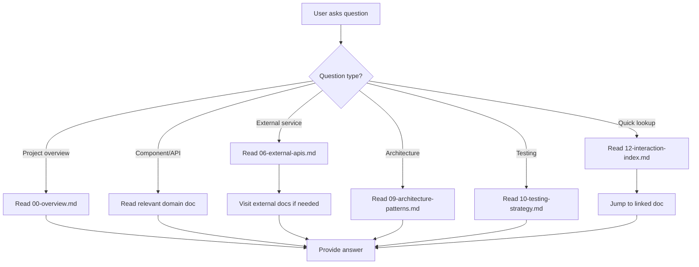

# Code Structure Reader

## Overview

**Systematically analyze codebase across 5 levels (structure → dependencies → call chains → data flow → architecture) and generate 12 maintainable, incremental-updateable Markdown documents with interaction index for fast project understanding.**

Core principle: One analysis pass generates organized documentation by domain layer (frontend/API/domain/database/quality/dev-guide), not by file, with smart incremental updates based on code changes.

## When to Use

### Primary Scenarios

**Symptoms indicating you need this skill:**

- **新人入职**: "这个项目结构太复杂,不知道从哪开始理解"
- **技术方案设计**: "不知道项目是否已有类似功能,可能重复开发"
- **代码审查**: "不清楚这个改动会影响哪些其他模块"
- **技术债务**: "需要量化代码质量问题,确定重构优先级"
- **文档维护**: "项目文档过时,需要系统性更新"
- **安全审计**: "需要了解依赖漏洞和安全风险"
- **测试理解**: "不知道项目的测试策略和覆盖率"

**Use cases:**
- 新成员快速 onboarding (30分钟上手)
- 技术方案设计时查找可复用能力
- 代码审查前理解影响范围
- 定期代码健康检查和技术债务分析
- 生成项目架构文档
- 安全扫描和合规性检查

### When NOT to Use

- ❌ 单个文件的简单查询 (使用 `Grep` 工具更直接)
- ❌ 只需要生成 README (使用其他文档技能)
- ❌ 分析很小的项目 (<10 文件)
- ❌ 不需要增量更新的文档

## Core Pattern

### Five-Level Progressive Analysis

```
Level 1: Directory Structure
    ↓
Level 2: Module Dependencies
    ↓
Level 3: Call Relationships
    ↓
Level 4: Data Flow
    ↓
Level 5: Architecture Patterns
```

**Key insight**: Each level builds on previous analysis - don't skip levels if you need deep understanding.

### Domain-Layered Documentation (12 Files)

```
Analysis Layer           → Document File
─────────────────────────────────────────
Project Overview       → 00-overview.md
Frontend Components   → 01-frontend-components.md
Backend APIs          → 02-backend-apis.md
Domain Models         → 03-backend-domains.md
Database Schemas      → 04-database-schemas.md
Third-party Deps      → 05-third-party-deps.md
External APIs*        → 06-external-apis.md (external services)
Dev Guide            → 07-dev-guide.md
Code Relations**      → 08-code-relations.md (deps + calls + flows)
Architecture Patterns  → 09-architecture-patterns.md
Testing Strategy      → 10-testing-strategy.md
Quality Reports**      → 11-quality-reports.md (debt + security)
Interaction Index***   → 12-interaction-index.md
```

*Merged files for better maintainability
**New file for external API documentation

### Smart Incremental Update

```bash
# Detect changes
git diff --name-only HEAD~1 HEAD

# Smart decision
CHANGED_FILES=$(git diff --name-only HEAD~1 HEAD | wc -l)
if [ $CHANGED_FILES -lt 10 ]; then
    → Incremental: Update only affected docs
else
    → Full: Re-run complete analysis
fi
```

**Change type → File mapping:**
| Change | Affected Files |
|---------|---------------|
| Frontend components | `01-frontend-components.md` |
| API routes | `02-backend-apis.md` + `08-code-relations.md` |
| Domain logic | `03-backend-domains.md` + `08-code-relations.md` |
| Database/models | `04-database-schemas.md` |
| package.json | `05-third-party-deps.md` + `11-quality-reports.md` |
| External API calls | `06-external-apis.md` |
| Config/scripts | `07-dev-guide.md` |
| **Code logic** | **`08-code-relations.md`** (unified) |
| Test files | `10-testing-strategy.md` |
| Architecture | `09-architecture-patterns.md` |
| Quality/Security | `11-quality-reports.md` (unified) |

## Quick Reference

### Analysis Commands by Level

**Level 1: Directory Structure**
```bash
# Generate tree structure
tree -L 3 -I 'node_modules|.git' > docs/structure.txt

# Or use find
find . -type f -name "*.ts" -o -name "*.js" | head -50
```

**Level 2: Module Dependencies**
```bash
# JavaScript/TypeScript
grep -r "import.*from" src/ --include="*.ts,*.tsx" | deps-graph

# Python
pdepend src/ | dot -T png > deps.png

# External API Detection (for 06-external-apis.md)
grep -r "fetch\|axios\|https://" src/ --include="*.ts,*.tsx,*.js" | external-calls
grep -r "import.*api\|from '.*api'" src/ --include="*.ts,*.tsx" | third-party-sdk
```

**Level 3: Call Chains**
```bash
# Static analysis (entry points)
grep -r "app.use\|router." src/ --include="*.ts"

# Dynamic tracing (if code is running)
# Use debugger/profiler tools
```

**Level 4: Data Flow**
```bash
# Trace request flow
# Follow HTTP request → middleware → controller → service → repository
```

**Level 5: Architecture Patterns**
```bash
# Detect patterns
grep -r "class.*Controller" src/  # MVC
grep -r "Repository" src/          # Repository
grep -r "Service" src/             # Service Layer
```

### Tech Stack Detection

```javascript
// package.json exists → Node.js
// pom.xml → Java/Maven
// requirements.txt → Python
// go.mod → Go
// Cargo.toml → Rust

// Further detect frameworks
"react" → React frontend
"vue" → Vue frontend
"express" → Express backend
"fastapi" → FastAPI backend
"spring-boot" → Spring Boot backend
```

### Output Locations

```bash
# Default location
./docs/project-analysis/

# Custom location via env
PROJECT_ANALYSIS_DIR=${PROJECT_ANALYSIS_DIR:-"./docs/project-analysis"}

# Or pass as argument
--output-dir /custom/path
```

## Implementation

### Step 1: Project Detection

```bash
# Detect project type
detect_project_type() {
    if [ -f "package.json" ]; then
        echo "nodejs"
    elif [ -f "requirements.txt" ]; then
        echo "python"
    elif [ -f "pom.xml" ]; then
        echo "java"
    fi
}

PROJECT_TYPE=$(detect_project_type)
echo "Detected: $PROJECT_TYPE"
```

### Step 2: Level-by-Level Analysis

**For each level, create corresponding output:**

```python
# Pseudo-code
levels = [
    {"name": "structure", "file": "00-overview.md"},
    {"name": "dependencies", "file": "08-code-relations.md"},
    {"name": "external-apis", "file": "06-external-apis.md"},
    {"name": "callchains", "file": "08-code-relations.md"},
    {"name": "dataflow", "file": "08-code-relations.md"},
    {"name": "architecture", "file": "09-architecture-patterns.md"}
]

for level in levels:
    analyze_level(level["name"])
    generate_doc(level["file"])
```

### Step 3: Generate 12 Files

```bash
# Create output directory
mkdir -p docs/project-analysis

# Generate files in order
create_file "00-overview.md" "# Project Overview\n..."
create_file "01-frontend-components.md" "# Frontend Components\n..."

# ⚠️ SPECIAL: External APIs requires user interaction
create_file "06-external-apis.md" "$(generate_external_apis_with_user_input)"

# ... continue for all 12 files
create_file "12-interaction-index.md" "# Interaction Index\n..."
```

**⚠️ CRITICAL for 06-external-apis.md:**

This file MUST involve user interaction:

1. **Auto-detect APIs from code:**
   - Scan for `fetch()`, `axios()`, third-party SDK imports
   - Compile detected APIs list

2. **Ask user if they want to add APIs:**
   - Use direct conversation (NOT AskUserQuestion tool)
   - Ask: "是否需要新增外部接口文档？"

3. **If user responds "是" or "需要":**
   - Ask for API details: "请提供接口信息（格式：名称|URL|功能描述）"
   - Example: "GitHub API|https://api.github.com|用于获取 GitHub 用户信息"
   - Parse user's input
   - Ask: "是否继续添加接口？"
   - Loop until user says "否"

4. **Merge and generate document:**
   - Combine detected APIs + user-provided APIs
   - Generate or update `06-external-apis.md`

### Step 3.5: External APIs Interactive Collection

**⚠️ CRITICAL: When generating or updating `06-external-apis.md`, MUST interact with user:**

**交互流程（实际执行步骤）:**

```markdown
# Claude 执行流程

## 1. 自动检测阶段
# 扫描代码中的外部 API 调用
detected_apis = [
    scan_for_fetch_calls(),
    scan_for_axios_calls(),
    scan_for_third_party_sdk_imports()
]

## 2. 用户交互阶段
# 直接询问用户（不使用 AskUserQuestion 工具）
Claude: "检测到以下外部 API: [列表]。是否需要新增外部接口文档？"

## 3. 用户回复"是"或"需要"
Claude: "请提供接口信息，格式：名称|URL|功能描述
         例如：GitHub API|https://api.github.com|用于获取 GitHub 用户信息"

# 等待用户输入...

## 4. 解析用户输入
# 用户提供: GitHub API|https://api.github.com|用于获取 GitHub 用户信息
parsed = {
    "name": "GitHub API",
    "url": "https://api.github.com",
    "description": "用于获取 GitHub 用户信息"
}

## 5. 询问是否继续
Claude: "是否继续添加接口？"

# 如果用户说"是"，返回步骤 3
# 如果用户说"否"，进入下一步

## 6. 生成/更新文件
all_apis = merge(detected_apis, user_provided_apis)
generate_or_update("06-external-apis.md", all_apis)
```

**关键要点:**

1. ❌ **不要使用 AskUserQuestion 工具**收集接口信息
   - AskUserQuestion 只支持预定义选项，不支持自由文本输入

2. ✅ **使用直接对话**收集信息
   - 直接向用户提问，等待用户回复
   - 解析用户的文本回复

3. ✅ **支持循环添加**
   - 每次添加一个接口后询问"是否继续添加接口？"
   - 直到用户说"否"为止

4. ✅ **输入格式灵活**
   - 可以使用 `名称|URL|功能描述` 格式
   - 也可以分别询问三个字段（如果用户输入格式不对）

**完整对话示例:**

```
Claude: 检测到以下外部 API:
       - Stripe Payment API (https://api.stripe.com)
       是否需要新增外部接口文档？

User:  是

Claude: 请提供接口信息，格式：名称|URL|功能描述
       例如：GitHub API|https://api.github.com|用于获取 GitHub 用户信息

User:  OpenWeather API|https://api.openweathermap.org|用于获取天气数据

Claude: 已添加: OpenWeather API
       是否继续添加接口？

User:  是

Claude: 请提供接口信息...

User:  Google Maps API|https://maps.googleapis.com|用于地图显示和地理编码

Claude: 已添加: Google Maps API
       是否继续添加接口？

User:  否

Claude: 正在生成 06-external-apis.md...
       [文件已更新]
```

**06-external-apis.md Template:**
```markdown
# External APIs

> **Purpose:** Document external service interfaces for design, development, and testing reference

## Detection Method

Auto-detected from code by scanning for:
- `fetch()`, `axios()` calls with external URLs
- Third-party SDK imports (e.g., `import S3 from 'aws-sdk'`)
- HTTP client libraries (e.g., `import { HttpClient } from '@angular/common/http'`)
- User-provided documentation via interactive collection

## How to Use This Document

When querying external APIs:
1. Find the service entry below
2. Extract the **Documentation URL**
3. Visit the URL for detailed API reference
4. Return usage instructions with examples

## External Services

### [Service Name]

**Base URL:** `https://api.example.com`

**Documentation URL:** `https://docs.example.com` ⭐ NEW - Required for querying

**功能描述:** [Brief description of what this API does]

**Authentication:**
- Method: API Key / OAuth 2.0 / Bearer Token
- Header Name: `Authorization` / `X-API-Key`
- Token Location: Environment variable / Config file
- ⭐ **How to Get:** [Link to getting API key/token]

**SDK/Client Libraries:**
- Official SDK: `https://npmjs.com/package/[package-name]` ⭐ NEW
- Language: JavaScript/TypeScript, Python, etc.
- Installation: `npm install [package-name]`

**Endpoints:**

| Method | Path | Purpose | Request Fields | Response Fields | Documentation Link |
|--------|------|---------|----------------|-----------------|-------------------|
| GET | `/api/users/:id` | Get user by ID | `id` | `id`, `name`, `email` | [Link to docs] ⭐ |
| POST | `/api/users` | Create user | `name`, `email` | `id`, `createdAt` | [Link to docs] ⭐ |

**Field Mapping (External → Internal):**

| External Field | Internal Field | Type | Transformation |
|----------------|----------------|------|----------------|
| `n` | `name` | string | Direct mapping |
| `ts` | `timestamp` | number | Convert to Date |

**Adapter Implementation:** `src/adapters/[ServiceName]Adapter.ts`

**Usage in Code:**
- `src/services/[ServiceName]Service.ts:45`
- `src/controllers/[Controller]Controller.ts:123`

**Quick Examples:** ⭐ NEW
```typescript
// Basic request example
const response = await fetch('https://api.example.com/endpoint', {
  headers: { 'Authorization': `Bearer ${API_KEY}` }
});
const data = await response.json();
```

---
```

**Template Notes:**
- ⭐ **Documentation URL is REQUIRED** - This is the primary field for querying API usage
- If documentation is at Base URL + "/docs", set Documentation URL explicitly
- Always include SDK/client library information when available
- Provide at least one working code example per service

**12-interaction-index.md Template:**
```markdown
# Project Documentation - Quick Reference

> **Purpose:** Interactive question index for quick navigation to relevant documentation

## Getting Started

- **New to the project?** Start with [Project Overview](./00-overview.md)
- **Setting up?** See [Development Guide](./07-dev-guide.md)
- **Looking for something specific?** Search this page with Ctrl/Cmd + F

---

## Common Questions

### Project Overview

| Question | Answer | Link |
|----------|--------|------|
| What is this project? | Project description and goals | [00-overview.md](./00-overview.md) |
| What tech stack does this use? | Frameworks, libraries, tools | [00-overview.md](./00-overview.md#tech-stack) |
| How do I set up the development environment? | Setup instructions and requirements | [07-dev-guide.md](./07-dev-guide.md) |
| How do I run the project? | Start, build, test commands | [07-dev-guide.md](./07-dev-guide.md#commands) |
| How do I deploy the project? | Deployment instructions | [07-dev-guide.md](./07-dev-guide.md#deployment) |

### Finding Code

| Question | Answer | Link |
|----------|--------|------|
| Where is the [feature] implemented? | Search by feature name | [08-code-relations.md](./08-code-relations.md) |
| What components do we have? | Component hierarchy and props | [01-frontend-components.md](./01-frontend-components.md) |
| What API endpoints are available? | API routes and request/response formats | [02-backend-apis.md](./02-backend-apis.md) |
| What are the main domain models? | Entities and business logic | [03-backend-domains.md](./03-backend-domains.md) |
| How is the database structured? | Tables, columns, relationships | [04-database-schemas.md](./04-database-schemas.md) |

### External APIs ⭐ NEW

| Question | Answer | Link |
|----------|--------|------|
| What external APIs does this project use? | List of all external services | [06-external-apis.md](./06-external-apis.md) |
| How do I use [Service Name] API? | Service documentation URL and usage | [06-external-apis.md](./06-external-apis.md#[service-name]) |
| How do we authenticate with [Service Name]? | Authentication method and token location | [06-external-apis.md](./06-external-apis.md#[service-name]) |
| Where is [Service Name] used in the code? | File locations and usage examples | [06-external-apis.md](./06-external-apis.md#[service-name]) |
| What endpoints does [Service Name] have? | Available endpoints and parameters | [06-external-apis.md](./06-external-apis.md#[service-name]) |

**External API Quick Links:** ⭐ NEW
- [GitHub API](./06-external-apis.md#github-api) - User and repository management
- [Stripe API](./06-external-apis.md#stripe-api) - Payment processing
- [AWS S3](./06-external-apis.md#aws-s3) - Cloud storage
- [SendGrid](./06-external-apis.md#sendgrid) - Email service
- [Add more services as documented...]

### Architecture & Design

| Question | Answer | Link |
|----------|--------|------|
| What architecture pattern is used? | MVC, Layered, Microservices, etc. | [09-architecture-patterns.md](./09-architecture-patterns.md) |
| How do modules depend on each other? | Dependency graph and relationships | [08-code-relations.md](./08-code-relations.md#dependencies) |
| What are the call chains for [feature]? | Request flow and method calls | [08-code-relations.md](./08-code-relations.md#call-chains) |
| What design patterns are used? | Identified patterns and locations | [09-architecture-patterns.md](./09-architecture-patterns.md#patterns) |

### Development Workflow

| Question | Answer | Link |
|----------|--------|------|
| How do I add a new feature? | Feature development workflow | [07-dev-guide.md](./07-dev-guide.md#feature-development) |
| How do I write tests? | Testing strategy and coverage | [10-testing-strategy.md](./10-testing-strategy.md) |
| What testing tools are used? | Test frameworks and utilities | [10-testing-strategy.md](./10-testing-strategy.md#tools) |
| How do I debug issues? | Debugging techniques and tools | [07-dev-guide.md](./07-dev-guide.md#debugging) |

### Dependencies & Libraries

| Question | Answer | Link |
|----------|--------|------|
| What third-party libraries do we use? | List of dependencies and versions | [05-third-party-deps.md](./05-third-party-deps.md) |
| Are there any security vulnerabilities? | Known security issues and fixes | [11-quality-reports.md](./11-quality-reports.md#security) |
| What licenses do our dependencies have? | License information | [05-third-party-deps.md](./05-third-party-deps.md#licenses) |

### Quality & Maintenance

| Question | Answer | Link |
|----------|--------|------|
| What technical debt exists? | Known issues and improvement areas | [11-quality-reports.md](./11-quality-reports.md#tech-debt) |
| What are the code complexity hotspots? | Complex code locations and metrics | [11-quality-reports.md](./11-quality-reports.md#complexity) |
| Are there any circular dependencies? | Dependency cycle reports | [08-code-relations.md](./08-code-relations.md#circular-deps) |

---

## Document Index

### Core Documents (Essential)

| # | Document | Description | Last Updated |
|---|----------|-------------|--------------|
| 00 | [Project Overview](./00-overview.md) | Project goals, tech stack, structure | [Date] |
| 07 | [Development Guide](./07-dev-guide.md) | Setup, build, debug, deploy | [Date] |
| 12 | [Interaction Index](./12-interaction-index.md) | This file - quick reference | [Date] |

### Architecture Documents

| # | Document | Description | Last Updated |
|---|----------|-------------|--------------|
| 08 | [Code Relations](./08-code-relations.md) | Dependencies, call chains, data flow | [Date] |
| 09 | [Architecture Patterns](./09-architecture-patterns.md) | Design patterns and architecture | [Date] |

### Domain Documents

| # | Document | Description | Last Updated |
|---|----------|-------------|--------------|
| 01 | [Frontend Components](./01-frontend-components.md) | UI components hierarchy | [Date] |
| 02 | [Backend APIs](./02-backend-apis.md) | API endpoints and formats | [Date] |
| 03 | [Backend Domains](./03-backend-domains.md) | Domain models and logic | [Date] |
| 04 | [Database Schemas](./04-database-schemas.md) | Database structure | [Date] |

### Integration Documents

| # | Document | Description | Last Updated |
|---|----------|-------------|--------------|
| 05 | [Third-party Dependencies](./05-third-party-deps.md) | External libraries and SDKs | [Date] |
| 06 | [External APIs](./06-external-apis.md) | External service integrations | [Date] |

### Quality Documents

| # | Document | Description | Last Updated |
|---|----------|-------------|--------------|
| 10 | [Testing Strategy](./10-testing-strategy.md) | Test coverage and tools | [Date] |
| 11 | [Quality Reports](./11-quality-reports.md) | Technical debt and security | [Date] |

---

## Search Tips

### Finding Information

**For specific features:**
1. Check [02-backend-apis.md](./02-backend-apis.md) for API endpoints
2. Check [03-backend-domains.md](./03-backend-domains.md) for domain logic
3. Use Ctrl/Cmd + F to search across all documents

**For external services:**
1. Check [06-external-apis.md](./06-external-apis.md) for the service
2. Click the Documentation URL link
3. Search the official documentation for your specific endpoint

**For code locations:**
1. Check [08-code-relations.md](./08-code-relations.md) for call chains
2. Check specific domain documents (01-04) for implementations

---

## Need Help?

- **Documentation outdated?** Run `code-structure-reader` skill to update
- **Can't find what you need?** Check [00-overview.md](./00-overview.md) for project context
- **Feature request?** Follow the development workflow in [07-dev-guide.md](./07-dev-guide.md)
```

**Template Notes:**
- Update [Service Name] placeholders with actual service names
- Add quick links for all documented external services
- Keep index updated when adding new services
- Include "Last Updated" dates for tracking document freshness

### Step 4: Incremental Update Detection

```bash
#!/bin/bash
# analyze-with-incremental.sh

# Get changed files
CHANGED_FILES=$(git diff --name-only HEAD~1 HEAD)

# Count changes
COUNT=$(echo "$CHANGED_FILES" | wc -l)

# Decide analysis mode
if [ $COUNT -lt 10 ]; then
    echo "Running incremental analysis..."
    # Map changes to affected docs
    update_affected_docs "$CHANGED_FILES"
else
    echo "Running full analysis..."
    # Re-run complete 5-level analysis
    run_full_analysis
fi
```

### Step 5: Generate Visualization

```markdown
<!-- In generated docs -->

## 依赖关系图
\`\`\`mermaid
graph LR
    A[AuthService] --> B[UserService]
    B --> C[Database]
    A --> C
\`\`\`

## 调用序列图
\`\`\`mermaid
sequenceDiagram
    participant User
    participant Frontend
    participant API
    User->>Frontend: 点击登录
    Frontend->>API: POST /auth/login
    API->>Frontend: 返回token
\`\`\`
```

## How to Use Generated Documentation

**⚠️ IMPORTANT: This section explains how to USE the generated documentation, not just generate it.**

The 12 generated documents serve as a knowledge base for ongoing development. When users ask questions about the codebase, follow these workflows to provide accurate, context-aware answers.

### General Query Workflow



### Querying External APIs

**⚠️ CRITICAL WORKFLOW for External API Questions:**

When users ask about external APIs (e.g., "How do I use GitHub API to get user info?"), follow this exact workflow:

```markdown
## External API Query Workflow

### Step 1: Read 06-external-apis.md
```bash
# Always start by reading the external APIs document
Read docs/project-analysis/06-external-apis.md
```

### Step 2: Find Relevant Service

**⚠️ CRITICAL: Use intelligent matching to find the most relevant service**

Search the document for:
- **Exact service name match** (highest priority)
- **Partial service name match** (e.g., "GitHub" matches "GitHub API")
- **Keywords in 功能描述 field** (e.g., "天气" matches OpenWeather)
- **Related endpoints in Endpoints table** (e.g., "/users" endpoint suggests user-related API)
- **SDK/library names** (e.g., "stripe" for Stripe Payment API)

**Intelligent Search Strategy:**

1. **Extract keywords from user query:**
   ```
   User query: "如何获取 github 用户信息？"
   → Extracted keywords: ["github", "用户", "信息", "获取"]
   ```

2. **Search with multiple strategies:**
   ```
   Strategy 1: Exact name match
     Search: "GitHub" → Found: "GitHub API" ✓

   Strategy 2: Partial name match (if no exact match)
     Search: "git" → Found: "GitHub API" ✓

   Strategy 3: Description keyword match (if no name match)
     Search: "用户信息" in 功能描述 → Found: "GitHub API" ✓

   Strategy 4: Endpoint keyword match (if no description match)
     Search: "/users" in Endpoints table → Found: "GitHub API" ✓
   ```

3. **Rank candidates by relevance:**
   ```
   Scoring:
   - Exact name match: 10 points
   - Partial name match: 5 points
   - Description keyword match: 3 points
   - Endpoint keyword match: 2 points

   Select service with highest score
   ```

4. **Handle edge cases:**
   - **No match found:** Inform user and offer to search web or add to documentation
   - **Multiple matches with same score:** Ask user to clarify which service
   - **Ambiguous query:** Suggest matching services and ask for confirmation

**Example - Fuzzy Matching:**
```
User: "怎么用 Stripe 支付？"

Claude's internal process:
1. Extract keywords: ["Stripe", "支付"]
2. Search strategies:
   - Exact name: "Stripe" → Found: "Stripe Payment API" (score: 10)
   - If not found: "payment" → Found in description
3. Best match: "Stripe Payment API"
4. Continue to Step 3...
```

**Example - Keyword Matching:**
```
User: "如何获取天气数据？"

Claude's internal process:
1. Extract keywords: ["天气", "数据", "获取"]
2. Search strategies:
   - Name search: "天气" → No exact match
   - Description search: "天气" in 功能描述 → Found: "OpenWeather API"
3. Best match: "OpenWeather API"
4. Continue to Step 3...
```

**Example - Multiple Candidates:**
```
User: "如何发送邮件？"

Claude's internal process:
1. Extract keywords: ["邮件", "发送"]
2. Search strategies:
   - Name search: "邮件" → No match
   - Description search:
     - "SendGrid" → 功能描述: "邮件发送服务" (score: 3)
     - "Mailgun" → 功能描述: "电子邮件API" (score: 3)
3. Multiple candidates with same score:
   Claude: "我发现项目使用了多个邮件服务。您是指：
     - SendGrid (事务性邮件)
     - Mailgun (营销邮件)
     请确认您需要使用哪个服务？"
```

**No Match Example:**
```
User: "如何使用 Google Maps API？"

Claude's internal process:
1. Extract keywords: ["Google", "Maps", "API"]
2. Search strategies:
   - Name search: "Google Maps" → Not found
   - Description search: "地图" → Not found
   - Endpoint search: "maps" → Not found
3. No match found:
   Claude: "我在项目文档中找不到 Google Maps API。
     项目中已记录的外部 API: [列出列表]
     您是否想要：
     1. 使用上述已记录的 API？
     2. 让我搜索 Google Maps 的官方文档？
     3. 将 Google Maps API 添加到项目文档中？"
```

### Step 3: Extract Documentation URL
From the service entry, find:
```markdown
**Documentation URL:** `https://docs.github.com/en/rest`  ⭐ NEW FIELD
```

If Documentation URL is missing, use:
- Base URL + "/docs" (common pattern)
- Base URL + "/documentation" (alternative pattern)
- Search for "docs" link in the service's official website

### Step 4: Visit External Documentation

**⚠️ CRITICAL: Use WebFetch tool to retrieve and understand API documentation**

From the service entry, find:
```markdown
**Documentation URL:** `https://docs.github.com/en/rest`  ⭐ NEW FIELD
```

**If Documentation URL is missing, use fallback strategies:**
- Base URL + "/docs" (common pattern)
- Base URL + "/documentation" (alternative pattern)
- Base URL + "/api" (many REST APIs)
- Search for "docs" link in the service's official website
- Use web search if all else fails

**WebFetch Workflow:**

```markdown
# Claude's detailed workflow:

## 1. Extract Documentation URL
From 06-external-apis.md service entry:
**Documentation URL:** `https://docs.github.com/en/rest`

## 2. Use WebFetch to retrieve documentation
Fetch the documentation page content:
→ Returns full HTML/Markdown content

## 3. Parse and search the documentation
Based on user's query, search for:
- Specific endpoint: e.g., "GET /users/{username}"
- Feature description: e.g., "get user information"
- Authentication section: e.g., "authentication", "API key"
- Code examples: e.g., code blocks in the documentation

## 4. Extract key information
From the documentation, extract:
- Endpoint method and path
- Required and optional parameters
- Request format (JSON, form data, etc.)
- Response format and fields
- Authentication method
- Rate limits (if documented)
- Code examples (if available)

## 5. Synthesize answer
Combine information from:
- 06-external-apis.md (project-specific: authentication, field mappings, usage in code)
- Official documentation (general: endpoints, parameters, examples)
- Return comprehensive, project-aware answer
```

**Handling Large Documentation:**

```markdown
# If documentation is very large:

## Strategy A: Targeted Search
Instead of fetching entire docs:
1. Use documentation site search (if available)
2. Construct direct URL to specific endpoint section
   Example: https://docs.github.com/en/rest/users#get-a-user
3. Fetch specific section directly

## Strategy B: Section-by-Section
If full docs are needed:
1. Fetch main page
2. Identify relevant sections from table of contents
3. Fetch specific sections as needed
4. Don't process entire documentation at once

## Strategy C: Use Examples First
Prioritize code examples:
1. Search for "example" or "sample" in documentation
2. These usually contain complete usage patterns
3. Extract and adapt examples for user's needs
```

**Example - Complete Workflow:**

```markdown
User: "如何使用 GitHub API 获取用户信息？"

## Claude's Internal Process:

### Step 1: Read 06-external-apis.md
Found entry:
```markdown
### GitHub API
**Base URL:** `https://api.github.com`
**Documentation URL:** `https://docs.github.com/en/rest`
**功能描述:** 用于获取 GitHub 用户和仓库信息
**Authentication:** Bearer Token in Authorization header
```

### Step 2: Extract Documentation URL
URL: https://docs.github.com/en/rest

### Step 3: Use WebFetch
Fetch: https://docs.github.com/en/rest
Content: [Full documentation page]

### Step 4: Search for relevant endpoint
Search documentation for: "get user", "user info", "users"
Found: "GET /users/{username}" endpoint section

### Step 5: Extract endpoint details
From documentation:
- Endpoint: GET /users/{username}
- Parameters: username (required)
- Response: id, login, name, email, etc.
- Authentication: Bearer token required

### Step 6: Synthesize answer
Return comprehensive answer with:
- Endpoint details
- Authentication method
- Code example (TypeScript)
- Response format
- Where it's used in project
```

### Step 5: Return Usage Instructions

Provide user with:
- **Endpoint details**: Method, path, parameters
- **Authentication**: How to authenticate requests
- **Code examples**: Practical usage in the project's language
- **Field mappings**: If documented in 06-external-apis.md
- **Related code**: Where this API is used in the project (from Usage in Code section)

**Example Response:**
```markdown
Based on the project's external API documentation and the official GitHub API docs:

## GitHub API - Get User Info

**Endpoint:** `GET /users/{username}`

**Authentication:**
- Use Bearer token in Authorization header
- Token from environment: `GITHUB_TOKEN`

**Request Example:**
```typescript
const response = await fetch(`https://api.github.com/users/${username}`, {
  headers: {
    'Authorization': `Bearer ${process.env.GITHUB_TOKEN}`,
    'Accept': 'application/vnd.github.v3+json'
  }
});
const user = await response.json();
```

**Response Fields:**
- `id`: User ID (number)
- `login`: Username (string)
- `name`: Full name (string)
- `email`: Email (string)

**Used in Project:**
- `src/services/githubService.ts:45` - GitHubUserService
- `src/controllers/userController.ts:123` - User integration

**For more details:** See https://docs.github.com/en/rest/users/get-a-user
```

### Handling Missing Information

If 06-external-apis.md doesn't have the required information:

1. **Documentation URL missing:**
   - Inform user: "External API documentation URL not found in project docs"
   - Suggest: "Would you like me to search for the official documentation?"
   - Or: Provide general knowledge about the API if available

2. **Service not documented:**
   - Inform user: "This external API is not documented in 06-external-apis.md"
   - Suggest: "Would you like me to add it to the documentation?"
   - Offer to run code-structure-reader skill to update docs

3. **Outdated information:**
   - Inform user: "The documentation may be outdated"
   - Offer: "Would you like me to fetch the latest API documentation?"

### Quick Reference Table

| User Question Type | Document to Read | Action |
|-------------------|------------------|---------|
| "How do I use [service] API?" | 06-external-apis.md | Find service → Visit docs → Return usage |
| "What external APIs do we use?" | 06-external-apis.md | List all services |
| "How do we authenticate with [service]?" | 06-external-apis.md | Find Authentication section |
| "Where is [service] used in code?" | 06-external-apis.md | Check Usage in Code section |
| "What endpoints does [service] have?" | 06-external-apis.md | Check Endpoints table |
| "Field mapping for [service]?" | 06-external-apis.md | Check Field Mapping table |

### Complete Example Dialogue

```
User: "I need to get weather data. How do I use the OpenWeather API?"

Claude's process:
1. Read docs/project-analysis/06-external-apis.md
2. Search for "OpenWeather" or "weather"
3. Found: "OpenWeather API" entry with:
   - Base URL: https://api.openweathermap.org
   - Documentation URL: https://openweathermap.org/api
4. Visit documentation URL
5. Find current weather endpoint: GET /data/2.5/weather
6. Extract parameters: q (city name), appid (API key)
7. Return comprehensive answer:

"Based on your project's external API documentation:

## OpenWeather API - Current Weather

**Endpoint:** `GET /data/2.5/weather`

**Parameters:**
- `q`: City name (required)
- `appid`: API key (required) - from `OPENWEATHER_API_KEY` env var
- `units`: Units of measurement (optional, default: metric)

**Example:**
```typescript
const weather = await fetch(
  `https://api.openweathermap.org/data/2.5/weather?q=${city}&appid=${process.env.OPENWEATHER_API_KEY}`
).then(r => r.json());
```

**Response includes:** Temperature, humidity, weather description, etc.

**Used in:** `src/services/weatherService.ts:23`
```

---

## Common Mistakes

### ❌ Analyzing by File Instead of Domain

**Wrong:**
```
Looking at src/utils/logger.ts in isolation
→ Missing how it connects to other modules
```

**Right:**
```
Understand logger is used by:
- src/backend/api/auth.ts
- src/backend/domain/user/service.ts
→ Update 02-backend-apis.md and 03-backend-domains.md
```

### ❌ Skipping Levels

**Wrong:**
```
Only doing Level 1 (structure)
→ Missing dependencies, call chains, architecture insights
```

**Right:**
```
Always complete all 5 levels progressively
Each level provides unique insights
```

### ❌ Not Generating Interaction Index

**Wrong:**
```
Generated 11 docs but no entry point
→ Users don't know where to start
```

**Right:**
```
ALWAYS create 12-interaction-index.md
Include common questions with links to specific docs
```

### ❌ Full Re-analysis on Small Changes

**Wrong:**
```
Changed 2 files → Re-running full 5-level analysis (takes 10+ minutes)
```

**Right:**
```
Changed 2 files → Update only affected docs (takes <30 seconds)
Use 10-file threshold for smart decision
```

### ❌ Merging Unrelated Content

**Wrong:**
```
Putting frontend components and database schemas in same doc
→ Hard to maintain, different update frequencies
```

**Right:**
```
Keep separate files:
- 01-frontend-components.md (updates on component changes)
- 04-database-schemas.md (updates on migration changes)
- 06-external-apis.md (updates on external API integration)
Merge only semantically related content (like 08-code-relations.md)
```

### ❌ Skipping User Interaction for External APIs

**Wrong:**
```
Auto-detecting external APIs and directly writing 06-external-apis.md
→ Missing APIs not called directly in code (e.g., documented but not yet implemented)
→ Missing business context and API purpose
```

**Right:**
```
ALWAYS interact with user when generating 06-external-apis.md
Use DIRECT CONVERSATION (not AskUserQuestion tool) to collect API information
Ask: "是否需要新增外部接口文档？"
If yes, ask: "请提供接口信息（格式：名称|URL|功能描述）"
Merge auto-detected APIs with user-provided APIs
```

**⚠️ CRITICAL: Do NOT use AskUserQuestion for collecting API details**
- AskUserQuestion only supports predefined choices, not free text input
- Use direct conversation instead: ask question → wait for user response → parse text

### ❌ Missing Documentation URL in External APIs

**Wrong:**
```
Documenting external API without Documentation URL
→ Claude cannot query the API usage
→ Users cannot find API documentation
→ Manual URL lookup required every time
```

**Right:**
```
ALWAYS include Documentation URL for each external service
Format: **Documentation URL:** `https://docs.example.com`
This enables automatic API querying and usage extraction
```

**Why this matters:**
- When users ask "How do I use [Service] API?", Claude needs the Documentation URL
- Without it, Claude must search the web or admit it doesn't know
- With it, Claude can fetch documentation and provide accurate usage instructions

## Real-World Impact

**Expected results:**

- ✅ **新员工上手时间**: 从4小时减少到30分钟 (-87.5%)
- ✅ **重复功能识别**: 在设计阶段发现现有能力,节省20%开发时间
- ✅ **代码审查效率**: 影响分析提前发现90%的潜在问题
- ✅ **技术债务可视化**: 量化质量指标,支持数据驱动的重构决策
- ✅ **文档维护成本**: 增量更新机制将文档同步时间从1小时减少到5分钟 (-92%)

**Team feedback:** [待补充实际使用后的反馈]

## Related Skills

**REQUIRED SUB-SKILLS:**
- Use **superpowers:writing-plans** for creating detailed implementation plans
- Use **superpowers:test-driven-development** when implementing analysis features
- Use **superpowers:brainstorming** when designing new analysis capabilities

**Optional complementary skills:**
- **superpowers:systematic-debugging** for understanding complex code behavior
- **superpowers:verification-before-completion** to ensure all docs are generated

## See Also

- Design document: `docs/plans/2025-02-11-code-structure-reader-design-v3.md`
- Implementation plan: `docs/plans/2025-02-11-code-structure-reader-plan.md` (to be created)
- Test cases: `tests/claude-code-structure-reader/` (to be created)
