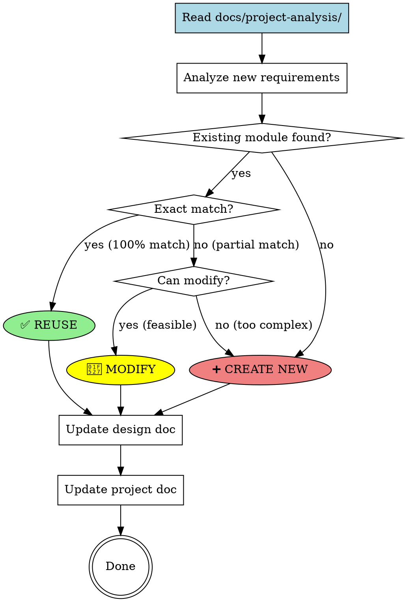

# Design with Existing Modules

## Overview

**Design technical solutions by first checking existing codebase for reusable modules, then making informed decisions: reuse → modify → create new.**

Core principle: Always analyze `docs/project-analysis/` documentation before designing to avoid duplication, ensure consistency, and leverage existing investments.

## When to Use

**Symptoms indicating you need this skill:**

- **技术方案设计**: "需要设计新功能,但不清楚是否已有类似实现"
- **避免重复开发**: "担心可能重复造轮子"
- **架构一致性**: "需要确保新功能与现有架构保持一致"
- **改造决策**: "不确定应该新建模块还是改造现有模块"
- **文档同步**: "需要保持项目文档与代码同步"

**Use cases:**
- 技术方案设计前的模块分析
- 评估现有代码的可复用性
- 决定是复用/改造/新增模块
- 保持项目文档的准确性
- 架构演进决策

### When NOT to Use

- ❌ 项目没有 `docs/project-analysis/` 目录（先用 `code-structure-reader`）
- ❌ 简单的 CRUD 操作（直接设计即可）
- ❌ 完全新的项目类型（无现有模块可参考）

## Core Pattern

### Three-Stage Decision Process



## Quick Reference

### Module Types to Check

| Module Type | Documentation File | Key Information |
|-------------|-------------------|-----------------|
| **Frontend Components** | `01-frontend-components.md` | Component hierarchy, props, state |
| **Backend APIs** | `02-backend-apis.md` | API endpoints, request/response formats |
| **Domain Models** | `03-backend-domains.md` | Entities, aggregates, business logic |
| **Database Schemas** | `04-database-schemas.md` | Tables, columns, relationships, indexes |
| **Third-party Deps** | `05-third-party-deps.md` | Available libraries and frameworks |
| **External APIs** | `06-external-apis.md` | External services, adapters, field mappings |
| **Dev Guide** | `07-dev-guide.md` | Setup, build, debug commands |
| **Code Relations** | `08-code-relations.md` | Dependencies, call chains, data flows |
| **Architecture Patterns** | `09-architecture-patterns.md` | Design patterns used in project |

### Decision Criteria

**✅ REUSE (100% match):**
- Existing module fully meets requirements
- No modification needed
- Just wire it up or configure

**🔧 MODIFY (partial match):**
- Existing module provides 60-90% of functionality
- Modification effort < creating from scratch
- Doesn't break existing consumers

**➕ CREATE NEW (no match):**
- No similar module exists
- Existing modules are too different ( < 60% match)
- Modification effort > creating new module

## Implementation

### Step 1: Read Project Analysis Documentation

**Check if documentation exists:**
```bash
# Verify project-analysis directory exists
if [ -d "docs/project-analysis" ]; then
    echo "✓ Project analysis found"
else
    echo "✗ No project analysis. Run superpowers:code-structure-reader first"
    exit 1
fi
```

**Read relevant documents based on requirements:**

> **⚠️ MANDATORY: Execute these Read steps before proceeding to Step 2**

> **For ALL design tasks, read these core documents:**
> - Read `docs/project-analysis/01-frontend-components.md`
> - Read `docs/project-analysis/02-backend-apis.md`
> - Read `docs/project-analysis/03-backend-domains.md`
> - Read `docs/project-analysis/04-database-schemas.md`

> **For specific requirements, also read:**
> - Frontend features: Already read above
> - API endpoints: Already read above
> - Business logic: Already read above
> - Data persistence: Already read above
> - Libraries: Read `docs/project-analysis/05-third-party-deps.md`
> - **External services**: Read `docs/project-analysis/06-external-apis.md`

> **⚠️ DO NOT PROCEED to Step 2 until all relevant documents have been read**

### Step 2: Analyze Requirements vs Existing Modules

For each requirement dimension:

```python
# Pseudo-code for analysis
for requirement in new_requirements:
    for module_type in ['frontend', 'api', 'domain', 'database']:
        existing_modules = read_project_analysis(module_type)

        matches = find_similar_modules(requirement, existing_modules)

        if matches:
            best_match = rank_by_similarity(matches)

            if best_match.similarity >= 0.95:
                decision = REUSE
                reason = f"100% match: {best_match.name}"
            elif best_match.similarity >= 0.60:
                decision = MODIFY
                reason = f"{best_match.similarity*100}% match: modify {best_match.name}"
                modification_plan = analyze_gaps(best_match, requirement)
            else:
                decision = CREATE_NEW
                reason = f"Only {best_match.similarity*100}% match, too different"
        else:
            decision = CREATE_NEW
            reason = "No similar module found"
```

### Step 3: Document Decisions in Design Document

**Format for design document (`docs/plans/YYYY-MM-DD-<feature>-design.md`):**

```markdown
## Part 2A: Backend Technical Design

### Module Reuse Analysis

#### ✅ REUSED MODULES

**AuthComponent** (from `01-frontend-components.md`)
- **Existing:** LoginForm, RegisterForm, PasswordReset
- **Decision:** REUSE 100%
- **Reasoning:** Existing auth components fully meet requirements
- **Integration:** No changes needed, just configure for new tenant

#### 🔧 MODIFIED MODULES

**UserService** (from `03-backend-domains.md`)
- **Existing:** User CRUD, profile management
- **Decision:** MODIFY to add 2FA functionality
- **Modification Plan:**
  - **From:** Simple password-based authentication
  - **To:** Multi-factor auth with TOTP support
  - **Changes Required:**
    - Add `TwoFactorAuth` entity to domain model
    - Add `verifyTotp(token)` method to UserService
    - Update database schema to store TOTP secrets
  - **Impact Analysis:**
    - Breaking change: No (backward compatible)
    - Existing consumers: unaffected
    - Migration required: Yes (add TOTP secret column)

#### ➕ NEW MODULES

**NotificationService** (NEW)
- **Decision:** CREATE NEW
- **Reasoning:**
  - No existing notification capability found
  - Required for real-time alerts
  - Cannot be easily added to existing services
- **Functionality:**
  - Multi-channel notifications (email, SMS, push)
  - Template management
  - Delivery tracking
- **Integration Points:**
  - Called by: OrderService, UserService
  - Depends on: MessageQueue (RabbitMQ)
  - Stores to: notification_log table
```

### Step 4: Update Project Documentation

**For REUSED modules:**
- No changes needed to project docs
- Just note in design doc that existing module is used

**For MODIFIED modules:**
- Update the corresponding `docs/project-analysis/` file
- Follow existing format exactly
- Mark changes with clear indicators

**Example for modifying UserService:**

```markdown
# File: docs/project-analysis/03-backend-domains.md

## UserService

**Description:** Manages user lifecycle and authentication

**Last Modified:** 2026-02-13 (added 2FA support)

### Core Methods

- `createUser(data)`: Create new user account
- `updateUser(id, data)`: Update user profile
- `authenticate(credentials)`: Authenticate user (password + TOTP)
- `verifyTotp(token)`: **[NEW]** Verify time-based one-time password
- `enableTotp(userId)`: **[NEW]** Enable two-factor authentication
- `disableTotp(userId)`: **[NEW]** Disable two-factor authentication

### Entities

#### User (existing)
- id: UUID
- email: String
- password_hash: String
- profile: JSONB
- totp_secret: String **[NEW]**
- totp_enabled: Boolean **[NEW]**
- created_at: Timestamp
- updated_at: Timestamp

#### TwoFactorAuth **[NEW]**
- id: UUID
- user_id: UUID (FK)
- secret: String
- backup_codes: String[]
- enabled_at: Timestamp
```

**For NEW modules:**
- Add new section to corresponding `docs/project-analysis/` file
- Follow exact same format as existing entries
- Include all required fields

**Example for new NotificationService:**

```markdown
# File: docs/project-analysis/02-backend-apis.md

## NotificationService API

**Description:** Multi-channel notification delivery service

**Added:** 2026-02-13

### Endpoints

#### POST /api/notifications/send
Send a notification through specified channels

**Request:**
```json
{
  "userId": "uuid",
  "channels": ["email", "sms", "push"],
  "template": "order_confirmation",
  "data": {
    "orderId": "uuid",
    "amount": 99.99
  }
}
```

**Response:** 202 Accepted
```json
{
  "notificationId": "uuid",
  "status": "queued",
  "estimatedDelivery": "2026-02-13T10:30:00Z"
}
```

#### GET /api/notifications/:id
Get notification delivery status

**Response:** 200 OK
```json
{
  "id": "uuid",
  "status": "delivered",
  "channels": {
    "email": "delivered",
    "sms": "delivered",
    "push": "failed"
  },
  "timestamp": "2026-02-13T10:31:00Z"
}
```
```

### Step 5: API Documentation Sync (CRITICAL)

> **⚠️ MANDATORY CHECKPOINT:**
>
> **Before completing the design, verify API documentation is synchronized:**
>
> 1. **Extract API Definitions** from the design document's Part 2A "API Design" section
> 2. **Read** `docs/project-analysis/02-backend-apis.md` to understand existing format
> 3. **For each NEW/MODIFIED API:**
>    - Append to `02-backend-apis.md` following the existing format
>    - Mark with `[NEW]` or `[MODIFIED date]` tags
>    - Include: endpoint, method, request/response schemas, error codes
> 4. **Verify** the file was updated correctly
> 5. **Ask user** to confirm: "已将 X 个 API 同步更新到 `docs/project-analysis/02-backend-apis.md`，请确认格式正确"
>
> **DO NOT proceed** until user confirms or file is verified updated.
>
> **Required output format for each API:**
> ```markdown
> #### METHOD /api/resource-name
> **描述:** 操作说明
> **请求:** `{field: type, ...}`
> **响应:** `{field: type, ...}`
> **错误码:** 列表
> ```

## Common Mistakes

### ❌ Not Checking All Module Types

**Wrong:**
```
Only checking frontend components, missing existing API
```

**Right:**
```
Check all 7 module types:
1. Frontend components
2. Backend APIs
3. Domain models
4. Database schemas
5. Third-party dependencies
6. Architecture patterns
7. Code relations
```

### ❌ Modifying When You Should Create New

**Wrong:**
```
Existing module is 30% match → Try to modify it anyway
Result: Over-engineering, breaking existing consumers
```

**Right:**
```
Existing module is 30% match → Create new module
Result: Clean separation, existing code unaffected
```

### ❌ Not Updating Project Documentation

**Wrong:**
```
Design doc says "modify UserService" → Update code → Forget docs
Result: Documentation becomes outdated
```

**Right:**
```
Design doc says "modify UserService" → Update code → Update docs/project-analysis/03-backend-domains.md
Result: Documentation stays current
```

### ❌ Inconsistent Format in Documentation

**Wrong:**
```
Add new module to docs with different format than existing entries
Result: Documentation is hard to read/maintain
```

**Right:**
```
Follow exact format of existing entries
Use same sections, same style, same detail level
Result: Consistent, maintainable documentation
```

## Real-World Impact

**Expected results:**

- ✅ **减少重复开发**: 在设计阶段发现可复用模块,节省 30-50% 开发时间
- ✅ **提高架构一致性**: 复用现有模式,减少技术债务
- ✅ **降低维护成本**: 复用经过测试的代码,减少 bug
- ✅ **保持文档准确性**: 同步更新项目文档,文档始终与代码一致
- ✅ **更好的改造决策**: 明确记录改造方案和原因,便于后续审查

## Related Skills

**REQUIRED BACKGROUND:**
- Must have **`superpowers:code-structure-reader`** documentation available at `docs/project-analysis/`

**REQUIRED SUB-SKILLS:**
- Use **`superpowers:brainstorming`** for the overall design process
- Use **`superpowers:writing-plans`** for detailed implementation planning

**Optional complementary skills:**
- **`superpowers:systematic-debugging`** for analyzing existing module behavior
- **`superpowers:test-driven-development`** when implementing modifications or new modules

## See Also

- Code structure reader: `skills/code-structure-reader/SKILL.md`
- Brainstorming: `skills/brainstorming/SKILL.md`
- Example design documents: `docs/plans/`

## Integration with Brainstorming Workflow

This skill integrates with **superpowers:brainstorming** as follows:

1. **After** brainstorming skill completes Part 1 (Business Requirements)
2. **Before** presenting Part 2A (Backend Technical Design) and Part 2B (Frontend Technical Design)
3. Use this skill to analyze existing modules
4. Incorporate analysis results into technical design sections
5. Update project documentation as part of design finalization

**Workflow:**
```
brainstorming: Part 1 (Business Requirements)
    ↓
design-with-existing-modules: Analyze & decide
    ↓
brainstorming: Part 2A & 2B (Technical Design with reuse/modify/new decisions)
    ↓
Update docs/project-analysis/ files
    ↓
brainstorming: Part 3 (Cross-Cutting Concerns)
```
