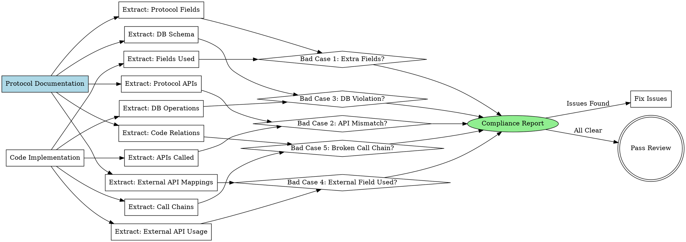

# Protocol Compliance Check

## Overview

**Verify code implementation matches protocol documentation by checking for undefined field usage, frontend-backend interface mismatches, and database schema violations.**

Core principle: Implementation must match design documentation - every field, API call, and database operation must be defined in protocol docs.

## When to Use

**Symptoms indicating you need this skill:**

- **代码审查前**: "需要验证代码实现是否符合技术方案文档"
- **前后端联调**: "前后端接口字段可能不一致"
- **数据库访问**: "代码中的数据库操作可能与架构文档不符"
- **协议验证**: "发现代码使用了未定义的字段或接口"

**Use cases:**
- Before merging PR (catch protocol violations early)
- During code review (automated compliance verification)
- Frontend-backend integration (detect field mismatches)
- Database schema validation (verify queries match schema)
- After refactoring (ensure no protocol violations introduced)

### When NOT to Use

- ❌ 项目没有 `docs/project-analysis/` 目录（先用 `code-structure-reader`）
- ❌ 没有技术方案设计文档（先完成 `brainstorming`）
- ❌ 仅检查代码质量（使用 `code-reviewer` 代替）
- ❌ 仅检查测试覆盖（使用 `test-driven-development` 代替）

## Core Pattern

### Three-Dimensional Compliance Check



## Quick Reference

### Three Bad Cases

| Bad Case | Description | Severity | Detection Method |
|----------|-------------|----------|------------------|
| **Bad Case 1** | 使用协议外的字段 | Critical | 字段白名单验证 |
| **Bad Case 2** | 前后端接口不一致 | Critical | 接口签名对比 |
| **Bad Case 3** | 数据库操作与架构不符 | Critical | Schema 验证 |
| **Bad Case 4** | 外部字段直接使用，无适配器 | Critical | 外部API调用检查 |
| **Bad Case 5** | 调用链断裂 | Critical | 组件集成/API调用验证 |

### Documentation Sources

| Document | Location | Content |
|----------|----------|---------|
| **Design Doc** | `docs/plans/YYYY-MM-DD-*-design.md` | Technical design, module decisions |
| **Backend APIs** | `docs/project-analysis/02-backend-apis.md` | API endpoints, request/response formats |
| **Domain Models** | `docs/project-analysis/03-backend-domains.md` | Entities, aggregates, business logic |
| **Database Schema** | `docs/project-analysis/04-database-schemas.md` | Tables, columns, relationships |
| **External APIs** | `docs/project-analysis/06-external-apis.md` | External services, adapters, field mappings |
| **Code Relations** | `docs/project-analysis/08-code-relations.md` | Dependencies, call chains, data flows |

## Implementation

### Step 1: Read Protocol Documentation

**Prerequisites Check:**
```bash
# Verify required documentation exists
if [ ! -d "docs/project-analysis" ]; then
    echo "❌ Missing project-analysis. Run superpowers:code-structure-reader first"
    exit 1
fi

if [ ! -f "docs/plans/"*"-design.md" ]; then
    echo "⚠️  No design document found. Proceeding with project-analysis only"
fi
```

**Read Protocol Documents:**

> **⚠️ MANDATORY: Execute these steps in order before proceeding**

> **Step 0:** Verify documentation exists (using the check above)

> **Step 1:** Read the core protocol documents:
> - Read `docs/project-analysis/02-backend-apis.md`
> - Read `docs/project-analysis/03-backend-domains.md`
> - Read `docs/project-analysis/04-database-schemas.md`

> **Step 2:** If code uses external services, also read:
> - Read `docs/project-analysis/06-external-apis.md`

> **Step 3:** For dependency analysis, read:
> - Read `docs/project-analysis/08-code-relations.md`

> **⚠️ DO NOT PROCEED until all relevant documents have been read**

### Step 2: Extract Code Implementation

**For each code file:**

**Frontend Code:**
```typescript
// Extract from .tsx, .ts, .jsx, .js files
- API calls (fetch, axios, api.*)
- Field access (object.field, object['field'])
- Component props
- State variables
```

**Backend Code:**
```typescript
// Extract from .ts, .js service/controller files
- API endpoint definitions
- Request/response handlers
- Database queries
- Field mappings
```

**Database Code:**
```sql
// Extract from .sql, repository files
- SELECT statements
- INSERT/UPDATE operations
- Table names
- Column names
```

### Step 3: Detect Bad Cases

Use detailed detection methods from:
- `badcase-detectors/detect-extra-fields.md` - Bad Case 1
- `badcase-detectors/detect-frontend-backend-mismatch.md` - Bad Case 2
- `badcase-detectors/detect-database-mismatch.md` - Bad Case 3
- Bad Case 4: External Field Inconsistency (inline)
- Bad Case 5: Broken Call Chain (inline)

### Step 4: Generate Compliance Report

**Report Structure:**
```markdown
# Protocol Compliance Report

**Generated:** [timestamp]
**Design Doc:** [path]
**Code Location:** [path]
**Reviewer:** [AI agent]

## Summary

- ✅ Passed: [count] checks
- ❌ Failed: [count] checks
- ⚠️ Warnings: [count] items

## Bad Case 1: Extra Fields (CRITICAL)

[Issues found]

## Bad Case 2: Frontend-Backend Mismatch (CRITICAL)

[Issues found]

## Bad Case 3: Database Schema Violation (CRITICAL)

[Issues found]

## Bad Case 4: External Field Inconsistency (CRITICAL)

[Issues found]

## Bad Case 5: Broken Call Chain (CRITICAL)

[Issues found]

## Recommendations

[Action items]
```

**Severity Levels:**
- **CRITICAL**: Blocks merge, must fix
- **HIGH**: Should fix before merge
- **MEDIUM**: Fix in follow-up PR
- **LOW**: Nice to have

## Detailed Bad Case Detection

### Bad Case 1: Extra Fields (越界使用)

**Definition:** Code uses fields not defined in protocol documentation

**Detection Rule:**
```
allowed_fields = extract_from_protocol_docs()
used_fields = extract_from_code()

extra_fields = used_fields - allowed_fields

if extra_fields:
    report_violation("CRITICAL", "Extra field used", extra_fields)
```

**Examples:**

**Example 1: Frontend uses undefined field**
```typescript
// Protocol (03-backend-domains.md)
interface User {
  id: string;
  name: string;
  email: string;
}

// Code (src/components/UserProfile.tsx)
const { phone, address } = user;  // ❌ phone, address not defined
```

**Example 2: Backend returns undefined field**
```typescript
// Protocol (02-backend-apis.md)
GET /api/users/:id
Response: { id, name, email }

// Code (src/controllers/UserController.ts)
return {
  id: user.id,
  name: user.name,
  email: user.email,
  avatar: user.avatar_url  // ❌ avatar not in protocol
};
```

**Detection Methods:**
- Static analysis: Parse code, extract field names
- Comparison: Used fields vs protocol whitelist
- Report: List violations with file:line references

### Bad Case 2: Frontend-Backend Mismatch (前后端不一致)

**Definition:** Frontend API calls don't match backend API definitions

**Detection Rule:**
```
frontend_calls = extract_frontend_api_usage()
backend_definitions = extract_backend_api_definitions()

mismatches = compare_signatures(frontend_calls, backend_definitions)

if mismatches:
    report_violation("CRITICAL", "API signature mismatch", mismatches)
```

**Examples:**

**Example 1: Request field mismatch**
```typescript
// Frontend (src/features/auth/login.tsx)
api.login({
  username: 'alice',  // ❌ mismatch
  password: 'secret'
})

// Backend (02-backend-apis.md)
POST /api/auth/login
Body: {
  email: string,     // ❌ expects email, not username
  password: string
}
```

**Example 2: Response field mismatch**
```typescript
// Frontend expects
const { data } = await api.getUser();
console.log(data.user.fullName);  // ❌ expects fullName

// Backend returns (02-backend-apis.md)
GET /api/users/:id
Response: {
  user: {
    id,
    firstName,  // ❌ has firstName, not fullName
    lastName
  }
}
```

**Example 3: Endpoint mismatch**
```typescript
// Frontend calls
api.getProfile(userId)  // ❌ calls GET /api/user/profile

// Backend defines (02-backend-apis.md)
GET /api/users/:id/profile  // ❌ different endpoint path
```

**Detection Methods:**
- API signature extraction from frontend code
- API definition extraction from backend code/docs
- Cross-reference: endpoint URL, method, request fields, response fields
- Report: Field-level mismatches with severity

### Bad Case 3: Database Schema Violation (数据库不一致)

**Definition:** Database operations don't match schema definition

**Detection Rule:**
```
schema_tables = extract_from_db_schema_docs()
code_operations = extract_from_code()

violations = validate_operations(code_operations, schema_tables)

if violations:
    report_violation("CRITICAL", "DB schema violation", violations)
```

**Examples:**

**Example 1: Query missing required field**
```typescript
// Schema (04-database-schemas.md)
CREATE TABLE users (
  id UUID PRIMARY KEY,
  name VARCHAR NOT NULL,
  email VARCHAR NOT NULL,
  created_at TIMESTAMP
);

// Code (src/repositories/UserRepository.ts)
SELECT id, name FROM users WHERE id = ?  // ❌ missing email
```

**Example 2: Insert uses undefined column**
```typescript
// Schema (04-database-schemas.md)
CREATE TABLE orders (
  id UUID PRIMARY KEY,
  user_id UUID,
  total DECIMAL
);

// Code (src/services/OrderService.ts)
INSERT INTO orders (id, user_id, total, status)
VALUES (?, ?, ?, ?)  // ❌ status column not defined
```

**Example 3: Query uses undefined table**
```sql
-- Schema (04-database-schemas.md)
-- Tables: users, orders, products

-- Code (src/reports/ReportRepository.ts)
SELECT * FROM user_logs  -- ❌ table user_logs not defined
```

**Detection Methods:**
- Parse SQL queries and ORM operations
- Extract table names, column names
- Compare against schema definitions
- Validate: tables exist, columns exist, types match
- Report: Schema violations with query location

### Bad Case 4: External Field Inconsistency (CRITICAL)

**Definition:** 直接使用外部接口的字段，没有通过适配器层统一处理，导致内部系统字段不一致。

**场景描述:**
当调用外部服务的不同接口时，外部接口返回的字段命名不一致：
- 外部接口 A 返回: `{ n: "value" }`
- 外部接口 B 返回: `{ name: "value" }`
- 外部服务无法修改接口
- 服务端代码中一边存 `name`，另一边存 `n`

**检测规则:**
```
for each code file:
    external_api_calls = extract_external_api_calls()

    for call in external_api_calls:
        if direct_external_field_usage(call):
            report_violation("CRITICAL", "External field used directly without adapter")

def direct_external_field_usage(call):
    # 检查是否直接使用外部响应的字段
    return (
        "external_field" in call.usage and
        "adapter" not in call.usage
    )
```

**示例:**

**Wrong (直接使用外部字段):**
```typescript
// ❌ 直接使用外部接口 A 的字段
class UserService {
    async getUserFromAPI_A() {
        const response = await fetch('https://api-a.com/user');
        const user = await response.json();
        // ❌ 直接使用外部字段 n
        return { name: user.n };
    }

    // ❌ 直接使用外部接口 B 的字段
    async getUserFromAPI_B() {
        const response = await fetch('https://api-b.com/user');
        const user = await response.json();
        // ❌ 使用不同的字段名
        return { name: user.name };
    }

    // 结果：数据库中同时存在 name 和 n，字段不一致！
}
```

**Right (通过适配器层):**
```typescript
// ✅ 适配器层 - 处理字段映射
class UserAdapterService {
    async getUserFromAPI_A() {
        const externalUser = await externalAPI_A.getUser();
        // 字段映射: n → name
        return {
            name: externalUser.n,
            externalId: externalUser.id
        };
    }

    async getUserFromAPI_B() {
        const externalUser = await externalAPI_B.getUser();
        // 字段映射: name → name (无需转换)
        return {
            name: externalUser.name,
            externalId: externalUser.id
        };
    }
}

// ✅ 统一的内部接口
class UserService {
    constructor(private adapter: UserAdapterService) {}

    async getUser(source: 'api-a' | 'api-b', externalId: string) {
        // 统一的内部字段: name
        return await this.adapter.getUser(source, externalId);
    }
}
```

**检测方法:**

1. **识别外部 API 调用**
   - HTTP 请求: `fetch`, `axios`, `http` (外部 URL)
   - 第三方 SDK: 调用外部服务的客户端库
   - API 客户端: 外部服务的 SDK

2. **检查字段使用**
   - 直接使用外部响应的字段: `response.externalField`
   - 没有经过适配器层的字段映射

3. **验证适配器层**
   - 是否有 `adapter`, `mapper`, `transform` 类/函数
   - 是否在 `docs/project-analysis/06-external-apis.md` 中记录了外部服务
   - 是否在 `docs/project-analysis/02-backend-apis.md` 中记录了适配器接口

4. **报告违规**
   - 位置: 文件:行号
   - 严重程度: CRITICAL
   - 建议: "创建适配器层处理外部字段映射"

**文档要求:**

**1. 外部接口文档: `docs/project-analysis/06-external-apis.md`**

```markdown
## [External Service Name]

**Base URL:** `https://api.example.com`

**Authentication:** API Key / OAuth 2.0

**Endpoints:**
| Method | Path | Purpose | Request Fields | Response Fields |
|--------|------|---------|----------------|-----------------|
| GET | `/api/users/:id` | Get user | `id` | `n`, `id` |

**Field Mapping (External → Internal):**
| External Field | Internal Field | Type | Transformation |
|----------------|----------------|------|----------------|
| `n` | `name` | string | Direct mapping |
| `id` | `externalId` | string | Rename to avoid collision |
```

**2. 内部适配器接口: `docs/project-analysis/02-backend-apis.md`**

```markdown
## External API Adapters

### UserAdapter
**Purpose:** 统一外部用户接口字段，隔离外部系统变化

**Internal Schema:**
```json
{
  "name": "string",
  "externalId": "string"
}
```

**Field Mappings:**
| Source | External Field | Internal Field | Notes |
|--------|---------------|----------------|-------|
| External API A | `n` | `name` | Direct mapping |
| External API A | `id` | `externalId` | Rename to avoid collision |
| External API B | `name` | `name` | No transformation |
| External API B | `id` | `externalId` | Rename to avoid collision |

**Implementation:** `src/adapters/UserAdapterService.ts`
```

**常见错误模式:**

❌ **错误 1: 在不同接口使用不同处理**
```typescript
// 接口 A
const nameA = externalUserA.n;
// 接口 B
const nameB = externalUserB.name;
// → 内部系统字段不统一！
```

❌ **错误 2: 在多处重复映射逻辑**
```typescript
// 重复的映射逻辑散落在各处
const name1 = externalUser1.n;
const name2 = externalUser2.n;
// → 映射逻辑不统一，难以维护
```

❌ **错误 3: 数据库中同时存在不一致的字段**
```typescript
// 存储时没有统一
await db.save({ name: valueFromA });    // 来自接口 A
await db.save({ n: valueFromB });       // 来自接口 B
// → 数据库中既有 name 又有 n，混乱！
```

✅ **正确: 统一的适配器层**
```typescript
// 所有外部接口都通过适配器
const user = await adapter.getUser(source, id);
const name = user.name;  // 统一使用内部字段
await db.save({ name, externalId });  // 统一存储
```

### Bad Case 5: Broken Call Chain (CRITICAL)

**Definition:** 前端组件或后端API开发完成，但没有正确集成到调用链中，导致功能不可达。

**场景描述:**
- **场景1**: 前端组件A开发完成，但没有调用后端接口B
- **场景2**: 后端接口B开发完成，但前端没有调用
- **场景3**: 前端组件A开发完成，但没有集成到任何页面（不可见）

**检测规则:**
```python
for each frontend component:
    # 检查1: 组件是否被导入到页面
    imported_in_pages = grep_component_imports(component, "src/pages/")
    if not imported_in_pages:
        report_violation("CRITICAL", "Component not integrated into any page",
                         component=component.name)

    # 检查2: 组件是否调用预期的后端API
    if component.should_call_backend_api:
        api_calls = extract_api_calls(component)
        if not api_calls:
            report_violation("CRITICAL",
                             "Component does not call expected backend API",
                             component=component.name,
                             expected_api=component.expected_api)

for each backend API:
    # 检查3: API是否有前端调用者
    frontend_callers = grep_api_usage(api, "src/")
    if not frontend_callers:
        report_warning("HIGH", "Backend API has no frontend callers",
                      api=api.path)
```

---

**示例 1: 前端组件未调用后端API**

**Wrong (组件开发完成但未调用API):**
```typescript
// Design Document: ComponentA should display user data from GET /api/users/:id

// ❌ ComponentA developed but doesn't call API
// src/components/ComponentA.tsx
export const ComponentA = () => {
  const [user, setUser] = useState(null);

  // Missing: useEffect to fetch from /api/users/:id
  // Component will always show null

  return <div>{user?.name}</div>;
};

// Protocol Compliance Check Result:
// ❌ CRITICAL: Component 'ComponentA' does not call expected API: GET /api/users/:id
//    Location: src/components/ComponentA.tsx:1-20
//    Expected: Component should fetch user data from backend
//    Actual: No API calls found in component
```

**Correct (组件正确调用API):**
```typescript
// ✅ ComponentA calls backend API as designed
// src/components/ComponentA.tsx
export const ComponentA = ({ userId }: { userId: string }) => {
  const [user, setUser] = useState<User | null>(null);

  useEffect(() => {
    // ✅ Calls backend API as documented in design
    fetch(`/api/users/${userId}`)
      .then(res => res.json())
      .then(data => setUser(data))
      .catch(err => console.error('Failed to fetch user:', err));
  }, [userId]);

  if (!user) return <div>Loading...</div>;
  return <div>{user.name}</div>;
};

// Protocol Compliance Check Result:
// ✅ PASS: Component 'ComponentA' calls expected API: GET /api/users/:id
//    Location: src/components/ComponentA.tsx:8
//    Verified: API endpoint matches protocol (02-backend-apis.md)
```

---

**示例 2: 前端组件未集成到页面**

**Wrong (组件开发完成但未被导入):**
```typescript
// ❌ ComponentA developed but not imported anywhere
// src/components/ComponentA.tsx exists
// src/pages/ doesn't import ComponentA

// Protocol Compliance Check Result:
// ❌ CRITICAL: Component 'ComponentA' not integrated into any page
//    Component file: src/components/ComponentA.tsx
//    Searched: src/pages/, src/routes/, src/app/
//    Found: 0 imports
//    Impact: Component is unreachable, users cannot see it
```

**Correct (组件正确集成到页面):**
```typescript
// ✅ ComponentA imported and rendered in page
// src/pages/Dashboard.tsx
import { ComponentA } from '../components/ComponentA';

export const Dashboard = () => {
  return (
    <div className="dashboard">
      <h1>User Dashboard</h1>
      <ComponentA userId="123" />  {/* ✅ Component is rendered */}
    </div>
  );
};

// Protocol Compliance Check Result:
// ✅ PASS: Component 'ComponentA' integrated into pages
//    Imported in: src/pages/Dashboard.tsx:1
//    Rendered at: src/pages/Dashboard.tsx:7
```

---

**示例 3: 后端API无前端调用者**

**Warning (API开发但未被使用):**
```typescript
// Backend API developed
// src/api/users.ts
export const getUserById = async (id: string) => {
  return await db.users.findUnique({ where: { id } });
};

// ❌ No frontend component calls this API

// Protocol Compliance Check Result:
// ⚠️  HIGH: Backend API 'GET /api/users/:id' has no frontend callers
//     API defined: src/api/users.ts:10-15
//     Searched: src/components/, src/pages/
//     Found: 0 callers
//     Possible reasons:
//       - Frontend not yet implemented
//       - API for internal/future use
//       - Frontend using wrong endpoint
```

---

**检测方法:**

**1. 组件集成检查**
```bash
# 检查组件是否被导入到页面
COMPONENT="ComponentName"
grep -r "import.*${COMPONENT}" src/pages/ src/routes/ src/app/ || {
  echo "❌ Component not imported in any page"
}

# 检查组件是否被渲染
grep -r "<${COMPONENT}" src/pages/ src/routes/ src/app/ || {
  echo "⚠️  Component imported but may not be rendered"
}
```

**2. API调用检查**
```bash
# 检查组件是否调用API
COMPONENT_FILE="src/components/ComponentName.tsx"
grep -E "(fetch|axios|api\.|client\.).*api/endpoint" "${COMPONENT_FILE}" || {
  echo "❌ Component does not call expected API"
}

# 检查API格式是否匹配协议
grep -o "api/[a-z/_]*" "${COMPONENT_FILE}" | while read endpoint; do
  grep -q "${endpoint}" docs/project-analysis/02-backend-apis.md || {
    echo "❌ API endpoint not in protocol: ${endpoint}"
  }
done
```

**3. 调用链文档验证**

如果 `docs/project-analysis/08-code-relations.md` 存在，验证实际实现与文档一致：

```bash
# 读取文档中的调用链
COMPONENT="ComponentA"
DOC_CHAIN=$(grep -A 20 "^## ${COMPONENT}" docs/project-analysis/08-code-relations.md)

# 验证API调用
echo "$DOC_CHAIN" | grep "API calls:" | grep -o "api/[^\"]*" | while read api; do
  grep -q "$api" "src/components/${COMPONENT}.tsx" || {
    echo "❌ Documented API not called: $api"
  }
done

# 验证页面集成
echo "$DOC_CHAIN" | grep "Imported by:" | grep -o "[A-Z][a-zA-Z]*Page" | while read page; do
  grep -q "import.*${COMPONENT}" "src/pages/${page}.tsx" || {
    echo "❌ Documented page integration missing: $page"
  }
done
```

---

**文档要求:**

**docs/project-analysis/08-code-relations.md 应包含:**
```markdown
## ComponentName

**Type:** Frontend Component

**File:** `src/components/ComponentName.tsx`

**Integrations:**
- **Imported by:** DashboardPage, ProfilePage
- **Renders:** UserProfile, ActionButtons
- **API calls:**
  - GET `/api/users/:id` (fetch user data)
  - POST `/api/users/:id/activate` (activate user)

**Call Chain:**
```
DashboardPage
  → ComponentName
    → API: GET /api/users/:id
      → UserService.getUserById()
        → Database: users table
```

**Data Flow:**
```
ComponentName (userId: string)
  → fetch('/api/users/${userId}')
  → UserService → Database
  ← User { id, name, email, ... }
  → Render UserProfile
```
```

---

**常见错误模式:**

❌ **错误 1: 开发了孤立的组件**
```typescript
// 组件A开发了完整的UI和逻辑
// 但既不调用API，也不被页面使用
// → 死代码，功能完全不可达
// → 测试通过但用户永远看不到这个功能
```

❌ **错误 2: 前后端开发不同步**
```typescript
// 前端组件A等待后端接口B
// 后端接口B已经开发完成
// 但前端组件A不知道接口B的存在，或调用了错误的endpoint
// → 组件A永远不会显示数据
// → 接口B白开发了（或被其他地方错误使用）
```

❌ **错误 3: 组件导入但未渲染**
```typescript
// src/pages/Dashboard.tsx
import { ComponentA } from '../components/ComponentA';
// ❌ 忘记在JSX中渲染 <ComponentA />
// → 组件被导入但不可见
```

✅ **正确: 端到端集成验证**
```typescript
// 开发流程:
// 1. 设计阶段: 定义调用链 (08-code-relations.md)
// 2. 开发前端组件A（包含API调用）
// 3. 开发后端接口B
// 4. 集成验证:
//    - ComponentA → API B → Backend → Database
//    - ComponentA 被页面导入并渲染
// 5. E2E测试: 完整流程验证
```

---

**与其他Bad Case的区别:**

| Bad Case | 检查内容 | 示例 |
|----------|---------|------|
| **Bad Case 1** | 使用了协议外的字段 | 前端使用 `phone` 但协议未定义 |
| **Bad Case 2** | 前后端接口字段不一致 | 前端传 `username`，后端要 `email` |
| **Bad Case 3** | 数据库操作与schema不符 | 查询不存在的列 |
| **Bad Case 4** | 外部字段直接使用，无适配器 | 直接使用外部API的 `n` 字段 |
| **Bad Case 5** | **调用链断裂** | **组件不调用API，或不被页面使用** |

**关键区别:**
- Bad Case 1-4: 检查**数据结构/格式**是否匹配
- **Bad Case 5**: 检查**调用关系**是否连通

---

## Common Mistakes

### ❌ Not Reading All Protocol Documents

**Wrong:**
```
Only checking API docs, missing domain model docs
→ Miss entity definitions that add context to APIs
```

**Right:**
```
Always read all relevant protocol docs:
- Design document (module decisions)
- API definitions (endpoints, formats)
- Domain models (entities, business logic)
- Database schema (tables, columns)
- Code relations (dependencies, flows)
```

### ❌ Ignoring Code-Generated Fields

**Wrong:**
```
Flag error for fields added by framework/ORM
→ False positives for legitimate fields
```

**Right:**
```
Check if field is:
- Defined in protocol → OK
- Added by framework (createdAt, updatedAt) → Document as exception
- Truly undefined → Report violation
```

### ❌ Not Checking Field Types

**Wrong:**
```
Only checking field names, not types
→ Miss type mismatches (string vs number)
```

**Right:**
```
Verify both field name AND type:
- Field name exists in protocol
- Field type matches protocol
- Field constraints match (nullable, required)
```

### ❌ Missing Context in Reports

**Wrong:**
```
"Field 'phone' not found"
→ Developer doesn't know where or why
```

**Right:**
```
"Field 'phone' used at src/components/User.tsx:45
 not defined in:
 - docs/project-analysis/03-backend-domains.md (User entity)
 - docs/project-analysis/02-backend-apis.md (GET /api/users/:id)
"
```

## Real-World Impact

**Expected results:**

- ✅ **减少协议违规**: 在合并前发现 95% 的不一致问题
- ✅ **提高前后端协作**: 自动检测接口不匹配，减少联调时间
- ✅ **降低线上故障**: 发现数据库schema违规，避免运行时错误
- ✅ **保持文档准确**: 强制文档与实现同步
- ✅ **加速代码审查**: 自动化检查，节省审查时间

## Related Skills

**REQUIRED BACKGROUND:**
- Must have **`superpowers:code-structure-reader`** documentation at `docs/project-analysis/`
- Must have **design document** at `docs/plans/*-design.md`

**REQUIRED SUB-SKILLS:**
- Use **`superpowers:requesting-code-review`** for overall review process
- Use **`superpowers:code-reviewer`** agent for quality review after compliance check

**Optional complementary skills:**
- **`superpowers:systematic-debugging`** for investigating complex violations
- **`superpowers:writing-plans`** for planning fixes to violations

## Integration with Code Review Workflow

This skill integrates with **superpowers:code-reviewer** and **superpowers:subagent-driven-development** as follows:

### In code-reviewer agent:

```markdown
## Plan Alignment Analysis

> **Protocol Compliance Check:**
> Before reviewing code quality, use **superpowers:protocol-compliance-check** to:
> 1. Verify all fields used are defined in protocol docs
> 2. Check frontend-backend interface alignment
> 3. Validate database operations match schema
>
> If critical violations found:
> - Severity: CRITICAL (blocks PR merge)
> - Action: Return to implementer for fixes
> - Do not proceed to quality review until compliance verified
```

### In subagent-driven-development:

**Updated workflow:**
```
Implementer implements task
    ↓
Implementer self-reviews
    ↓
Spec compliance reviewer
    ↓
**Protocol compliance check** ⭐ NEW
    ↓
Code quality reviewer (only if compliance passes)
    ↓
Mark task complete
```

## See Also

- Bad Case 1 detector: `badcase-detectors/detect-extra-fields.md`
- Bad Case 2 detector: `badcase-detectors/detect-frontend-backend-mismatch.md`
- Bad Case 3 detector: `badcase-detectors/detect-database-mismatch.md`
- Report template: `compliance-report-template.md`
- Integration guide: `docs/feature-protocol-compliance-check.md`
