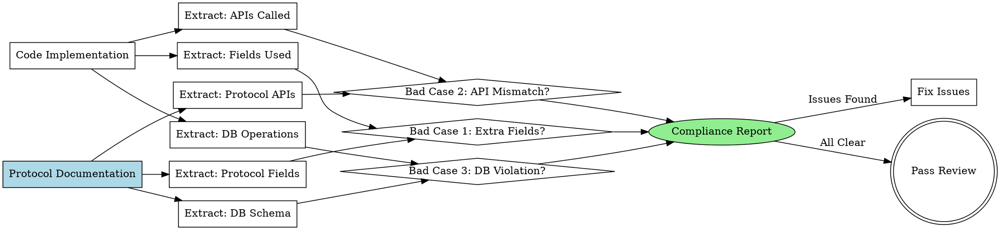

# Protocol Compliance Check

## Overview

**Verify code implementation matches protocol documentation by checking for undefined field usage, frontend-backend interface mismatches, and database schema violations.**

Core principle: Implementation must match design documentation - every field, API call, and database operation must be defined in protocol docs.

## When to Use

**Symptoms indicating you need this skill:**

- **代码审查前**: "需要验证代码实现是否符合技术方案文档"
- **前后端联调**: "前后端接口字段可能不一致"
- **数据库访问**: "代码中的数据库操作可能与架构文档不符"
- **协议验证**: "发现代码使用了未定义的字段或接口"

**Use cases:**
- Before merging PR (catch protocol violations early)
- During code review (automated compliance verification)
- Frontend-backend integration (detect field mismatches)
- Database schema validation (verify queries match schema)
- After refactoring (ensure no protocol violations introduced)

### When NOT to Use

- ❌ 项目没有 `docs/project-analysis/` 目录（先用 `code-structure-reader`）
- ❌ 没有技术方案设计文档（先完成 `brainstorming`）
- ❌ 仅检查代码质量（使用 `code-reviewer` 代替）
- ❌ 仅检查测试覆盖（使用 `test-driven-development` 代替）

## Core Pattern

### Three-Dimensional Compliance Check



## Quick Reference

### Three Bad Cases

| Bad Case | Description | Severity | Detection Method |
|----------|-------------|----------|------------------|
| **Bad Case 1** | 使用协议外的字段 | Critical | 字段白名单验证 |
| **Bad Case 2** | 前后端接口不一致 | Critical | 接口签名对比 |
| **Bad Case 3** | 数据库操作与架构不符 | Critical | Schema 验证 |

### Documentation Sources

| Document | Location | Content |
|----------|----------|---------|
| **Design Doc** | `docs/plans/YYYY-MM-DD-*-design.md` | Technical design, module decisions |
| **Backend APIs** | `docs/project-analysis/02-backend-apis.md` | API endpoints, request/response formats |
| **Domain Models** | `docs/project-analysis/03-backend-domains.md` | Entities, aggregates, business logic |
| **Database Schema** | `docs/project-analysis/04-database-schemas.md` | Tables, columns, relationships |
| **Code Relations** | `docs/project-analysis/07-code-relations.md` | Dependencies, call chains, data flows |

## Implementation

### Step 1: Read Protocol Documentation

**Prerequisites Check:**
```bash
# Verify required documentation exists
if [ ! -d "docs/project-analysis" ]; then
    echo "❌ Missing project-analysis. Run superpowers:code-structure-reader first"
    exit 1
fi

if [ ! -f "docs/plans/"*"-design.md" ]; then
    echo "⚠️  No design document found. Proceeding with project-analysis only"
fi
```

**Read Protocol Documents:**
1. Find latest design document: `docs/plans/*-design.md`
2. Read API definitions: `docs/project-analysis/02-backend-apis.md`
3. Read domain models: `docs/project-analysis/03-backend-domains.md`
4. Read database schema: `docs/project-analysis/04-database-schemas.md`
5. Read code relations: `docs/project-analysis/07-code-relations.md`

### Step 2: Extract Code Implementation

**For each code file:**

**Frontend Code:**
```typescript
// Extract from .tsx, .ts, .jsx, .js files
- API calls (fetch, axios, api.*)
- Field access (object.field, object['field'])
- Component props
- State variables
```

**Backend Code:**
```typescript
// Extract from .ts, .js service/controller files
- API endpoint definitions
- Request/response handlers
- Database queries
- Field mappings
```

**Database Code:**
```sql
// Extract from .sql, repository files
- SELECT statements
- INSERT/UPDATE operations
- Table names
- Column names
```

### Step 3: Detect Bad Cases

Use detailed detection methods from:
- `badcase-detectors/detect-extra-fields.md` - Bad Case 1
- `badcase-detectors/detect-frontend-backend-mismatch.md` - Bad Case 2
- `badcase-detectors/detect-database-mismatch.md` - Bad Case 3

### Step 4: Generate Compliance Report

**Report Structure:**
```markdown
# Protocol Compliance Report

**Generated:** [timestamp]
**Design Doc:** [path]
**Code Location:** [path]
**Reviewer:** [AI agent]

## Summary

- ✅ Passed: [count] checks
- ❌ Failed: [count] checks
- ⚠️ Warnings: [count] items

## Bad Case 1: Extra Fields (CRITICAL)

[Issues found]

## Bad Case 2: Frontend-Backend Mismatch (CRITICAL)

[Issues found]

## Bad Case 3: Database Schema Violation (CRITICAL)

[Issues found]

## Recommendations

[Action items]
```

**Severity Levels:**
- **CRITICAL**: Blocks merge, must fix
- **HIGH**: Should fix before merge
- **MEDIUM**: Fix in follow-up PR
- **LOW**: Nice to have

## Detailed Bad Case Detection

### Bad Case 1: Extra Fields (越界使用)

**Definition:** Code uses fields not defined in protocol documentation

**Detection Rule:**
```
allowed_fields = extract_from_protocol_docs()
used_fields = extract_from_code()

extra_fields = used_fields - allowed_fields

if extra_fields:
    report_violation("CRITICAL", "Extra field used", extra_fields)
```

**Examples:**

**Example 1: Frontend uses undefined field**
```typescript
// Protocol (03-backend-domains.md)
interface User {
  id: string;
  name: string;
  email: string;
}

// Code (src/components/UserProfile.tsx)
const { phone, address } = user;  // ❌ phone, address not defined
```

**Example 2: Backend returns undefined field**
```typescript
// Protocol (02-backend-apis.md)
GET /api/users/:id
Response: { id, name, email }

// Code (src/controllers/UserController.ts)
return {
  id: user.id,
  name: user.name,
  email: user.email,
  avatar: user.avatar_url  // ❌ avatar not in protocol
};
```

**Detection Methods:**
- Static analysis: Parse code, extract field names
- Comparison: Used fields vs protocol whitelist
- Report: List violations with file:line references

### Bad Case 2: Frontend-Backend Mismatch (前后端不一致)

**Definition:** Frontend API calls don't match backend API definitions

**Detection Rule:**
```
frontend_calls = extract_frontend_api_usage()
backend_definitions = extract_backend_api_definitions()

mismatches = compare_signatures(frontend_calls, backend_definitions)

if mismatches:
    report_violation("CRITICAL", "API signature mismatch", mismatches)
```

**Examples:**

**Example 1: Request field mismatch**
```typescript
// Frontend (src/features/auth/login.tsx)
api.login({
  username: 'alice',  // ❌ mismatch
  password: 'secret'
})

// Backend (02-backend-apis.md)
POST /api/auth/login
Body: {
  email: string,     // ❌ expects email, not username
  password: string
}
```

**Example 2: Response field mismatch**
```typescript
// Frontend expects
const { data } = await api.getUser();
console.log(data.user.fullName);  // ❌ expects fullName

// Backend returns (02-backend-apis.md)
GET /api/users/:id
Response: {
  user: {
    id,
    firstName,  // ❌ has firstName, not fullName
    lastName
  }
}
```

**Example 3: Endpoint mismatch**
```typescript
// Frontend calls
api.getProfile(userId)  // ❌ calls GET /api/user/profile

// Backend defines (02-backend-apis.md)
GET /api/users/:id/profile  // ❌ different endpoint path
```

**Detection Methods:**
- API signature extraction from frontend code
- API definition extraction from backend code/docs
- Cross-reference: endpoint URL, method, request fields, response fields
- Report: Field-level mismatches with severity

### Bad Case 3: Database Schema Violation (数据库不一致)

**Definition:** Database operations don't match schema definition

**Detection Rule:**
```
schema_tables = extract_from_db_schema_docs()
code_operations = extract_from_code()

violations = validate_operations(code_operations, schema_tables)

if violations:
    report_violation("CRITICAL", "DB schema violation", violations)
```

**Examples:**

**Example 1: Query missing required field**
```typescript
// Schema (04-database-schemas.md)
CREATE TABLE users (
  id UUID PRIMARY KEY,
  name VARCHAR NOT NULL,
  email VARCHAR NOT NULL,
  created_at TIMESTAMP
);

// Code (src/repositories/UserRepository.ts)
SELECT id, name FROM users WHERE id = ?  // ❌ missing email
```

**Example 2: Insert uses undefined column**
```typescript
// Schema (04-database-schemas.md)
CREATE TABLE orders (
  id UUID PRIMARY KEY,
  user_id UUID,
  total DECIMAL
);

// Code (src/services/OrderService.ts)
INSERT INTO orders (id, user_id, total, status)
VALUES (?, ?, ?, ?)  // ❌ status column not defined
```

**Example 3: Query uses undefined table**
```sql
-- Schema (04-database-schemas.md)
-- Tables: users, orders, products

-- Code (src/reports/ReportRepository.ts)
SELECT * FROM user_logs  -- ❌ table user_logs not defined
```

**Detection Methods:**
- Parse SQL queries and ORM operations
- Extract table names, column names
- Compare against schema definitions
- Validate: tables exist, columns exist, types match
- Report: Schema violations with query location

## Common Mistakes

### ❌ Not Reading All Protocol Documents

**Wrong:**
```
Only checking API docs, missing domain model docs
→ Miss entity definitions that add context to APIs
```

**Right:**
```
Always read all relevant protocol docs:
- Design document (module decisions)
- API definitions (endpoints, formats)
- Domain models (entities, business logic)
- Database schema (tables, columns)
- Code relations (dependencies, flows)
```

### ❌ Ignoring Code-Generated Fields

**Wrong:**
```
Flag error for fields added by framework/ORM
→ False positives for legitimate fields
```

**Right:**
```
Check if field is:
- Defined in protocol → OK
- Added by framework (createdAt, updatedAt) → Document as exception
- Truly undefined → Report violation
```

### ❌ Not Checking Field Types

**Wrong:**
```
Only checking field names, not types
→ Miss type mismatches (string vs number)
```

**Right:**
```
Verify both field name AND type:
- Field name exists in protocol
- Field type matches protocol
- Field constraints match (nullable, required)
```

### ❌ Missing Context in Reports

**Wrong:**
```
"Field 'phone' not found"
→ Developer doesn't know where or why
```

**Right:**
```
"Field 'phone' used at src/components/User.tsx:45
 not defined in:
 - docs/project-analysis/03-backend-domains.md (User entity)
 - docs/project-analysis/02-backend-apis.md (GET /api/users/:id)
"
```

## Real-World Impact

**Expected results:**

- ✅ **减少协议违规**: 在合并前发现 95% 的不一致问题
- ✅ **提高前后端协作**: 自动检测接口不匹配，减少联调时间
- ✅ **降低线上故障**: 发现数据库schema违规，避免运行时错误
- ✅ **保持文档准确**: 强制文档与实现同步
- ✅ **加速代码审查**: 自动化检查，节省审查时间

## Related Skills

**REQUIRED BACKGROUND:**
- Must have **`superpowers:code-structure-reader`** documentation at `docs/project-analysis/`
- Must have **design document** at `docs/plans/*-design.md`

**REQUIRED SUB-SKILLS:**
- Use **`superpowers:requesting-code-review`** for overall review process
- Use **`superpowers:code-reviewer`** agent for quality review after compliance check

**Optional complementary skills:**
- **`superpowers:systematic-debugging`** for investigating complex violations
- **`superpowers:writing-plans`** for planning fixes to violations

## Integration with Code Review Workflow

This skill integrates with **superpowers:code-reviewer** and **superpowers:subagent-driven-development** as follows:

### In code-reviewer agent:

```markdown
## Plan Alignment Analysis

> **Protocol Compliance Check:**
> Before reviewing code quality, use **superpowers:protocol-compliance-check** to:
> 1. Verify all fields used are defined in protocol docs
> 2. Check frontend-backend interface alignment
> 3. Validate database operations match schema
>
> If critical violations found:
> - Severity: CRITICAL (blocks PR merge)
> - Action: Return to implementer for fixes
> - Do not proceed to quality review until compliance verified
```

### In subagent-driven-development:

**Updated workflow:**
```
Implementer implements task
    ↓
Implementer self-reviews
    ↓
Spec compliance reviewer
    ↓
**Protocol compliance check** ⭐ NEW
    ↓
Code quality reviewer (only if compliance passes)
    ↓
Mark task complete
```

## See Also

- Bad Case 1 detector: `badcase-detectors/detect-extra-fields.md`
- Bad Case 2 detector: `badcase-detectors/detect-frontend-backend-mismatch.md`
- Bad Case 3 detector: `badcase-detectors/detect-database-mismatch.md`
- Report template: `compliance-report-template.md`
- Integration guide: `docs/feature-protocol-compliance-check.md`
