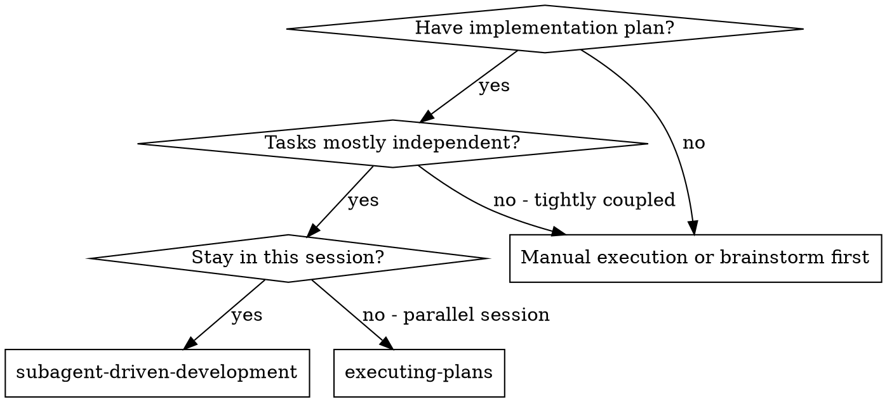
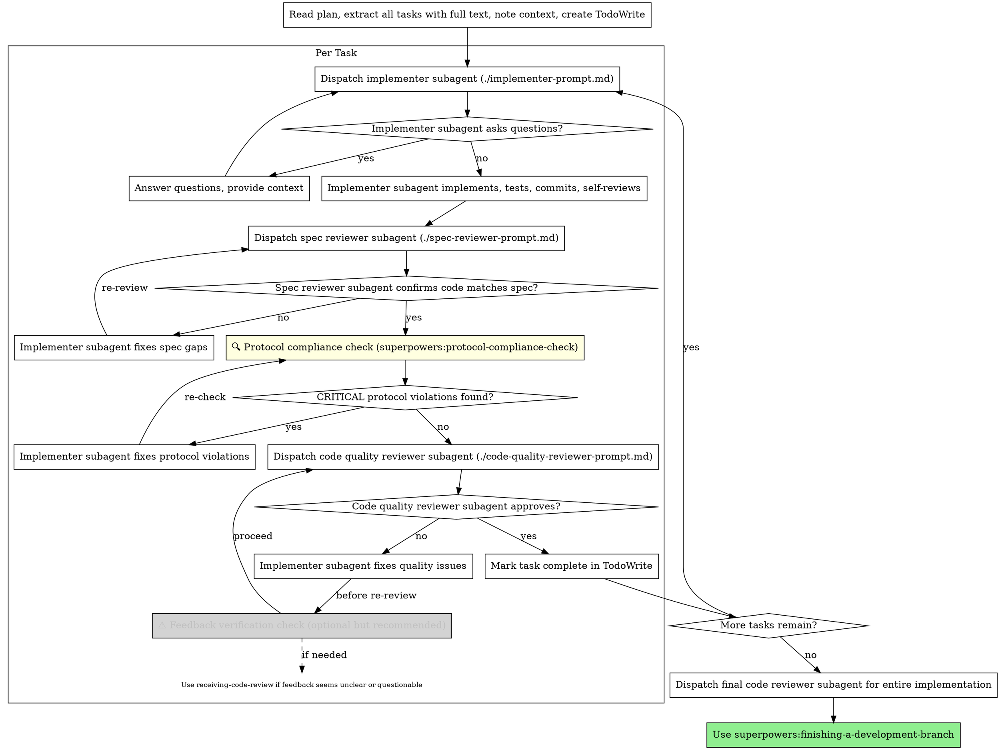

# Subagent-Driven Development

Execute plan by dispatching fresh subagent per task, with two-stage review after each: spec compliance review first, then code quality review.

**Core principle:** Fresh subagent per task + two-stage review (spec then quality) = high quality, fast iteration

## When to Use



**vs. Executing Plans (parallel session):**
- Same session (no context switch)
- Fresh subagent per task (no context pollution)
- Two-stage review after each task: spec compliance first, then code quality
- Faster iteration (no human-in-loop between tasks)

**Record to Execution Log:**
```markdown
- [ ] Update EXECUTION_LOG.md with:
  - Phase: Subagent-Driven Development
  - Action: Dispatched subagent for task "{task-name}"
  - Details: Task completion summary, files modified, test results
  - Next: {next-step}
```

## The Process



## Prompt Templates

- `./implementer-prompt.md` - Dispatch implementer subagent
- `./spec-reviewer-prompt.md` - Dispatch spec compliance reviewer subagent
- `./code-quality-reviewer-prompt.md` - Dispatch code quality reviewer subagent

## Example Workflow

```
You: I'm using Subagent-Driven Development to execute this plan.

[Read plan file once: docs/plans/feature-plan.md]
[Extract all 5 tasks with full text and context]
[Create TodoWrite with all tasks]

Task 1: Hook installation script

[Get Task 1 text and context (already extracted)]
[Dispatch implementation subagent with full task text + context]

Implementer: "Before I begin - should the hook be installed at user or system level?"

You: "User level (~/.config/superpowers/hooks/)"

Implementer: "Got it. Implementing now..."
[Later] Implementer:
  - Implemented install-hook command
  - Added tests, 5/5 passing
  - Self-review: Found I missed --force flag, added it
  - Committed

[Dispatch spec compliance reviewer]
Spec reviewer: ✅ Spec compliant - all requirements met, nothing extra

[🔍 Protocol compliance check]
Protocol check: ✅ No violations - all fields defined, frontend-backend aligned, database operations match schema

[Get git SHAs, dispatch code quality reviewer]
Code reviewer: Strengths: Good test coverage, clean. Issues: None. Approved.

[⚠️ Feedback verification check - no issues to verify, proceed]

[Mark Task 1 complete]

Task 2: Recovery modes

[Get Task 2 text and context (already extracted)]
[Dispatch implementation subagent with full task text + context]

Implementer: [No questions, proceeds]
Implementer:
  - Added verify/repair modes
  - 8/8 tests passing
  - Self-review: All good
  - Committed

[Dispatch spec compliance reviewer]
Spec reviewer: ❌ Issues:
  - Missing: Progress reporting (spec says "report every 100 items")
  - Extra: Added --json flag (not requested)

[Implementer fixes issues]
Implementer: Removed --json flag, added progress reporting

[Spec reviewer reviews again]
Spec reviewer: ✅ Spec compliant now

[🔍 Protocol compliance check]
Protocol check: ✅ No violations - implementation matches protocol docs

[Dispatch code quality reviewer]
Code reviewer: Strengths: Solid. Issues (Important): Magic number (100)

[Implementer fixes]
Implementer: Extracted PROGRESS_INTERVAL constant

[Code reviewer reviews again]
Code reviewer: ✅ Approved

[⚠️ Feedback verification check - no issues to verify, proceed]

[Mark Task 2 complete]

Task 3: Error handling edge case

[Get Task 3 text and context (already extracted)]
[Dispatch implementation subagent with full task text + context]

Implementer: [No questions, proceeds]
Implementer:
  - Added error boundary component
  - 6/6 tests passing
  - Self-review: All good
  - Committed

[Dispatch spec compliance reviewer]
Spec reviewer: ✅ Spec compliant

[🔍 Protocol compliance check]
Protocol check: ✅ No violations

[Dispatch code quality reviewer]
Code reviewer: Issues (Critical):
  - Suggests: "Replace try-catch with global error handler"
  - Suggests: "Remove logging as it's redundant"

[⚠️ Feedback verification check - feedback seems questionable]
Controller: This feedback conflicts with the task requirement ("handle errors locally")
          Let me verify this feedback BEFORE implementing...

[Step 1: Use superpowers:receiving-code-review]
Verification result:
  ❌ "Global error handler" - WRONG: Task requires local error handling
  ❌ "Remove logging" - WRONG: Spec explicitly requires error logging
  ✅ Decision: Reject this feedback, implementation is correct

[Controller to Implementer]: Ignore the code reviewer's suggestions - they contradict the spec. Your implementation is correct.

[Implementer confirms]: Understood - keeping local error handling and logging as per spec.

[⚠️ NO further action needed - feedback rejected, no TDD/debugging required]

Task 4: Extract validation logic (feedback accepted)

[Get Task 4 text and context (already extracted)]
[Dispatch implementation subagent with full task text + context]

Implementer:
  - Added validation functions
  - Tests passing
  - Committed

[Dispatch code quality reviewer]
Code reviewer: Issues (Important):
  - "Validation logic duplicated in 3 places, extract to shared module"

[⚠️ Feedback verification check]
Controller: This seems reasonable, let me verify...

[Step 1: Use superpowers:receiving-code-review]
Verification result:
  ✅ Suggestion aligns with DRY principle
  ✅ No conflicts with spec
  ✅ Project has shared utilities module pattern
  ✅ Decision: Accept this feedback

[Controller to Implementer]: Extract validation logic to shared module.

[Implementer uses test-driven-development]
RED: Add test for extracted validation function
GREEN: Extract validation to shared module, make tests pass
REFACTOR: Clean up imports

[Test failure encountered during GREEN]
[Implementer uses systematic-debugging]
Phase 1: Reproduce - Test fails with "TypeError: validation not a function"
Phase 2: Isolate - Issue only with email validation
Phase 3: Fix - Missing export for emailValidator
Phase 4: Verify - All tests passing

[Implementer uses verification-before-completion]
Run: npm test -- --testPathPattern=validation
Output: ✅ 12/12 tests passing
Run: npm run lint
Output: ✅ No linting errors
Result: Implementation verified, ready for re-review

[Code reviewer reviews again]
Code reviewer: ✅ Approved - clean extraction, good coverage

[Mark Task 4 complete]

Task 5: Frontend UserList component

[Get Task 5 text and context (already extracted)]
[Dispatch implementation subagent with full task text + context]

Implementer:
  - Created UserList component
  - Added unit tests, 8/8 passing
  - Self-review: All good
  - Committed

[Dispatch spec compliance reviewer]
Spec reviewer: ✅ Spec compliant

[🔍 Protocol compliance check]
Protocol check: ⚠️ BAD CASE 5 DETECTED
  - Component 'UserList' does not call expected API: GET /api/users
  - Component 'UserList' not integrated into any page
  Severity: CRITICAL

[Implementer fixes issues]
Implementer:
  - Added useEffect to fetch from /api/users
  - Imported UserList in Dashboard.tsx
  - Rendered <UserList /> in dashboard
  - Re-running unit tests: ✅ 8/8 passing
  - Committed

[🔍 Protocol compliance check - re-verify]
Protocol check: ✅ No violations
  - Component calls API: GET /api/users
  - Component integrated in: Dashboard.tsx

[Implementer uses verification-before-completion]
Run: npm test -- --testPathPattern=UserList
Output: ✅ 8/8 tests passing

[⚠️ Component Integration Verification]
Run: ./verify-integration.sh UserList "api/users"
Output:
  ✅ Component 'UserList' imported in pages
  ✅ Component 'UserList' rendered in pages
  ✅ Component calls API endpoint: api/users
  ✅ API endpoint has frontend callers

Result: Component integration verified, ready for review

[Get git SHAs, dispatch code quality reviewer]
Code reviewer: Strengths: Good component structure, proper integration. Issues: None. Approved.

[⚠️ Feedback verification check - no issues to verify, proceed]

[Mark Task 5 complete]

...

[After all tasks]
[Dispatch final code-reviewer]
Final reviewer: All requirements met, ready to merge

Done!
```

## Advantages

**vs. Manual execution:**
- Subagents follow TDD naturally
- Fresh context per task (no confusion)
- Parallel-safe (subagents don't interfere)
- Subagent can ask questions (before AND during work)

**vs. Executing Plans:**
- Same session (no handoff)
- Continuous progress (no waiting)
- Review checkpoints automatic

**Efficiency gains:**
- No file reading overhead (controller provides full text)
- Controller curates exactly what context is needed
- Subagent gets complete information upfront
- Questions surfaced before work begins (not after)

**Quality gates:**
- Self-review catches issues before handoff
- Three-stage review: spec compliance, then **protocol compliance**, then code quality
- Review loops ensure fixes actually work
- Spec compliance prevents over/under-building
- **Protocol compliance ensures implementation matches design documentation (fields, APIs, database)**
- Code quality ensures implementation is well-built

**Cost:**
- More subagent invocations (implementer + 3 reviews per task: spec, protocol, quality)
- Controller does more prep work (extracting all tasks upfront)
- Review loops add iterations
- Protocol compliance check adds one more gate
- But catches issues early (cheaper than debugging later)

## Red Flags

**Never:**
- Start implementation on main/master branch without explicit user consent
- Skip reviews (spec compliance OR protocol compliance OR code quality)
- Proceed with unfixed issues
- Dispatch multiple implementation subagents in parallel (conflicts)
- Make subagent read plan file (provide full text instead)
- Skip scene-setting context (subagent needs to understand where task fits)
- Ignore subagent questions (answer before letting them proceed)
- Accept "close enough" on spec compliance (spec reviewer found issues = not done)
- Skip review loops (reviewer found issues = implementer fixes = review again)
- Let implementer self-review replace actual review (all three are needed)
- **Start code quality review before protocol compliance is ✅** (wrong order)
- **Skip protocol compliance check** (protocol violations = broken contracts)
- Move to next task while any review has open issues

**If subagent asks questions:**
- Answer clearly and completely
- Provide additional context if needed
- Don't rush them into implementation

**If reviewer finds issues:**
- Implementer (same subagent) fixes them
- Reviewer reviews again
- Repeat until approved
- Don't skip the re-review

**If code reviewer feedback seems questionable:**
- **Step 1: Use superpowers:receiving-code-review** to verify feedback BEFORE implementing
- Check if feedback contradicts spec/requirements
- Check if feedback is technically correct for this codebase
- Reject feedback that would break existing functionality
- Don't blindly implement every suggestion
- **If accepted → proceed with implementation:**
  - Step 2: Use **test-driven-development** for implementation
  - Step 3 (if needed): Use **systematic-debugging** if tests fail
  - Step 4: Use **verification-before-completion** before claiming done
- **If rejected → no further action needed**
- Example triggers:
  - Suggests removing features explicitly required by spec
  - Suggests architectural changes without understanding context
  - Recommends practices that conflict with project conventions
  - Provides vague feedback like "improve this" without specifics

**If subagent fails task:**
- Dispatch fix subagent with specific instructions
- Don't try to fix manually (context pollution)

## Integration

**Required workflow skills:**
- **superpowers:using-git-worktrees** - REQUIRED: Set up isolated workspace before starting
- **superpowers:writing-plans** - Creates the plan this skill executes
- **superpowers:protocol-compliance-check** - REQUIRED: Verify implementation matches protocol docs
- **superpowers:requesting-code-review** - Code review template for reviewer subagents
- **superpowers:finishing-a-development-branch** - Complete development after all tasks

**Optional but recommended skills:**
- **superpowers:receiving-code-review** - Verify code review feedback before implementing (use when feedback seems questionable or conflicts with spec)

**Subagents should use:**
- **superpowers:test-driven-development** - Subagents follow TDD for each task

**Alternative workflow:**
- **superpowers:executing-plans** - Use for parallel session instead of same-session execution
