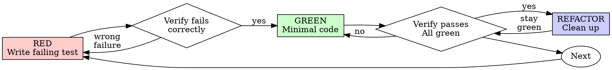

# Test-Driven Development (TDD)

## Overview

Write the test first. Watch it fail. Write minimal code to pass.

**Core principle:** If you didn't watch the test fail, you don't know if it tests the right thing.

**Violating the letter of the rules is violating the spirit of the rules.**

## When to Use

**Always:**
- New features
- Bug fixes
- Refactoring
- Behavior changes

**Exceptions (ask your human partner):**
- Throwaway prototypes
- Generated code
- Configuration files

Thinking "skip TDD just this once"? Stop. That's rationalization.

## The Iron Law

```
NO PRODUCTION CODE WITHOUT A FAILING TEST FIRST
```

Write code before the test? Delete it. Start over.

**No exceptions:**
- Don't keep it as "reference"
- Don't "adapt" it while writing tests
- Don't look at it
- Delete means delete

Implement fresh from tests. Period.

## Red-Green-Refactor



### RED - Write Failing Test

**Step 0: Verify Protocol Compliance (MANDATORY CHECKPOINT)**

> **⚠️ CRITICAL: Do NOT write any test code until this step is complete.**
>
> **Before writing test, you MUST:**
>
> 1. **Check if protocol documentation exists:**
>    ```bash
>    # Verify required documents exist
>    ls docs/project-analysis/02-backend-apis.md
>    ls docs/project-analysis/03-backend-domains.md
>    ls docs/project-analysis/04-database-schemas.md
>    ```
>
> 2. **If documents exist, read them and verify:**
>    - ✅ Field names match protocol (e.g., use `symbol`, NOT `ts_code`)
>    - ✅ API paths match protocol (e.g., `/api/users/:id/profile`, NOT `/api/user/profile`)
>    - ✅ Request/response structures match protocol
>    - ✅ Database columns match schema
>
> 3. **If documents DO NOT exist:**
>    ```bash
>    # STOP! Generate protocol documentation first
>    Use Skill tool: superpowers:code-structure-reader
>    ```
>    - Wait for code-structure-reader to complete
>    - Then read the generated documents
>    - Proceed with verification
>
> **🔍 PROTOCOL CHANGE DETECTION:**
>
> Before writing test, ask yourself:
> - Is this test using NEW fields not currently in the protocol?
> - Is this test MODIFYING existing field definitions?
> - Is this test CHANGING the API structure?
>
> **If ANY YES → This is a PROTOCOL CHANGE:**
>
> 1. **STOP writing code immediately**
>
> 2. **Read current protocol documentation:**
>    ```bash
>    # Read to understand existing format
>    Read docs/project-analysis/02-backend-apis.md
>    ```
>
> 3. **Update protocol documentation using Edit tool:**
>    ```markdown
>    # Find the relevant API/Entity section in the file
>    # Add the new/modified field in the correct format
>
>    ## [Entity/API Name]
>
>    ### [field_name] [NEW YYYY-MM-DD]
>    - **Type:** string | number | boolean | etc.
>    - **Description:** Field description
>    - **Required:** true | false
>    - **Example:** Example value
>    ```
>
>    **For NEW field:**
>    ```markdown
>    ### avatar [NEW 2025-02-26]
>    - **Type:** string
>    - **Description:** User avatar URL
>    - **Required:** false
>    ```
>
>    **For MODIFIED field:**
>    ```markdown
>    ### email [MODIFIED 2025-02-26]
>    - **Required:** false (was: true)
>    - **Change:** Made optional for social login
>    ```
>
> 4. **Verify frontend-backend alignment:**
>    - Frontend uses: `field_name`
>    - Backend provides: `field_name`
>    - Protocol defines: `field_name`
>    - All three MUST match exactly
>
> 5. **Present changes to user for confirmation:**
>    ```markdown
>    **协议变更检测：**
>
>    检测到需要修改协议文档：
>    - 变更类型: [NEW/MODIFIED]
>    - 字段名称: field_name
>    - 更新位置: docs/project-analysis/02-backend-apis.md
>
>    已更新协议文档，前后端使用字段: `field_name`
>
>    请确认是否继续？
>    ```
>
> 6. **Only after user confirms:** Continue to Step 1
>
> **Protocol change examples:**
>
> **Scenario 1: Adding a new field**
> ```typescript
> // ❌ WRONG: Just write test with new field
> test('user has avatar', () => {
>   expect(user.avatar).toBe('url');
> });
>
> // ✅ RIGHT: Update protocol first
> // 1. Update docs/project-analysis/02-backend-apis.md
> // 2. Add: [NEW FIELD] avatar: string
> // 3. Then write test
> ```
>
> **Scenario 2: Changing field name**
> ```typescript
> // ❌ WRONG: Use different field name in test
> test('user profile', () => {
>   expect(user.fullName).toBe('John');  // protocol says firstName + lastName
> });
>
> // ✅ RIGHT: Update protocol first
> // 1. Update docs/project-analysis/03-backend-domains.md
> // 2. Mark: [MODIFIED date] fullName replaced firstName + lastName
> // 3. Then write test
> ```
>
> 4. **Document your findings:**
>    - "According to docs/project-analysis/02-backend-apis.md, the field name is `symbol`"
>    - "API endpoint is GET /api/stocks/:symbol"
>
> **🔍 EXTERNAL API CHECK:**
>
> **If test involves external interface calls:**
> - Read `docs/project-analysis/06-external-apis.md`
> - Verify external API field mappings (external → internal)
> - Mock external responses according to documented schema
> - Document: "External API returns `n`, mapped to internal field `name`"
>
> **Only after completing Step 0:** Proceed to Step 1
>
> **Common mistakes to avoid:**
> - ❌ Using field names from other contexts (e.g., `ts_code` from legacy code)
> - ❌ Assuming API paths without checking documentation
> - ❌ Guessing database column names
> - ❌ Skipping this step to "save time"
> - ❌ **Adding new fields without updating protocol**
> - ❌ **Modifying fields without marking in protocol**

**Step 1: Write the failing test**

Write one minimal test showing what should happen.

<Good>
```typescript
test('retries failed operations 3 times', async () => {
  let attempts = 0;
  const operation = () => {
    attempts++;
    if (attempts < 3) throw new Error('fail');
    return 'success';
  };

  const result = await retryOperation(operation);

  expect(result).toBe('success');
  expect(attempts).toBe(3);
});
```
Clear name, tests real behavior, one thing
</Good>

<Bad>
```typescript
test('retry works', async () => {
  const mock = jest.fn()
    .mockRejectedValueOnce(new Error())
    .mockRejectedValueOnce(new Error())
    .mockResolvedValueOnce('success');
  await retryOperation(mock);
  expect(mock).toHaveBeenCalledTimes(3);
});
```
Vague name, tests mock not code
</Bad>

**Requirements:**
- One behavior
- Clear name
- Real code (no mocks unless unavoidable)

### Verify RED - Watch It Fail

**MANDATORY. Never skip.**

```bash
npm test path/to/test.test.ts
```

Confirm:
- Test fails (not errors)
- Failure message is expected
- Fails because feature missing (not typos)

**Test passes?** You're testing existing behavior. Fix test.

**Test errors?** Fix error, re-run until it fails correctly.

### GREEN - Minimal Code

Write simplest code to pass the test.

<Good>
```typescript
async function retryOperation<T>(fn: () => Promise<T>): Promise<T> {
  for (let i = 0; i < 3; i++) {
    try {
      return await fn();
    } catch (e) {
      if (i === 2) throw e;
    }
  }
  throw new Error('unreachable');
}
```
Just enough to pass
</Good>

<Bad>
```typescript
async function retryOperation<T>(
  fn: () => Promise<T>,
  options?: {
    maxRetries?: number;
    backoff?: 'linear' | 'exponential';
    onRetry?: (attempt: number) => void;
  }
): Promise<T> {
  // YAGNI
}
```
Over-engineered
</Bad>

Don't add features, refactor other code, or "improve" beyond the test.

### Verify GREEN - Watch It Pass

**MANDATORY.**

```bash
npm test path/to/test.test.ts
```

Confirm:
- Test passes
- Other tests still pass
- Output pristine (no errors, warnings)

**Test fails?** Fix code, not test.

**Other tests fail?** Fix now.

### REFACTOR - Clean Up

After green only:
- Remove duplication
- Improve names
- Extract helpers

Keep tests green. Don't add behavior.

### Repeat

Next failing test for next feature.

## Good Tests

| Quality | Good | Bad |
|---------|------|-----|
| **Minimal** | One thing. "and" in name? Split it. | `test('validates email and domain and whitespace')` |
| **Clear** | Name describes behavior | `test('test1')` |
| **Shows intent** | Demonstrates desired API | Obscures what code should do |

## Why Order Matters

**"I'll write tests after to verify it works"**

Tests written after code pass immediately. Passing immediately proves nothing:
- Might test wrong thing
- Might test implementation, not behavior
- Might miss edge cases you forgot
- You never saw it catch the bug

Test-first forces you to see the test fail, proving it actually tests something.

**"I already manually tested all the edge cases"**

Manual testing is ad-hoc. You think you tested everything but:
- No record of what you tested
- Can't re-run when code changes
- Easy to forget cases under pressure
- "It worked when I tried it" ≠ comprehensive

Automated tests are systematic. They run the same way every time.

**"Deleting X hours of work is wasteful"**

Sunk cost fallacy. The time is already gone. Your choice now:
- Delete and rewrite with TDD (X more hours, high confidence)
- Keep it and add tests after (30 min, low confidence, likely bugs)

The "waste" is keeping code you can't trust. Working code without real tests is technical debt.

**"TDD is dogmatic, being pragmatic means adapting"**

TDD IS pragmatic:
- Finds bugs before commit (faster than debugging after)
- Prevents regressions (tests catch breaks immediately)
- Documents behavior (tests show how to use code)
- Enables refactoring (change freely, tests catch breaks)

"Pragmatic" shortcuts = debugging in production = slower.

**"Tests after achieve the same goals - it's spirit not ritual"**

No. Tests-after answer "What does this do?" Tests-first answer "What should this do?"

Tests-after are biased by your implementation. You test what you built, not what's required. You verify remembered edge cases, not discovered ones.

Tests-first force edge case discovery before implementing. Tests-after verify you remembered everything (you didn't).

30 minutes of tests after ≠ TDD. You get coverage, lose proof tests work.

## Common Rationalizations

| Excuse | Reality |
|--------|---------|
| "Too simple to test" | Simple code breaks. Test takes 30 seconds. |
| "I'll test after" | Tests passing immediately prove nothing. |
| "Tests after achieve same goals" | Tests-after = "what does this do?" Tests-first = "what should this do?" |
| "Already manually tested" | Ad-hoc ≠ systematic. No record, can't re-run. |
| "Deleting X hours is wasteful" | Sunk cost fallacy. Keeping unverified code is technical debt. |
| "Keep as reference, write tests first" | You'll adapt it. That's testing after. Delete means delete. |
| "Need to explore first" | Fine. Throw away exploration, start with TDD. |
| "Test hard = design unclear" | Listen to test. Hard to test = hard to use. |
| "TDD will slow me down" | TDD faster than debugging. Pragmatic = test-first. |
| "Manual test faster" | Manual doesn't prove edge cases. You'll re-test every change. |
| "Existing code has no tests" | You're improving it. Add tests for existing code. |

## Red Flags - STOP and Start Over

- Code before test
- Test after implementation
- Test passes immediately
- Can't explain why test failed
- Tests added "later"
- Rationalizing "just this once"
- "I already manually tested it"
- "Tests after achieve the same purpose"
- "It's about spirit not ritual"
- "Keep as reference" or "adapt existing code"
- "Already spent X hours, deleting is wasteful"
- "TDD is dogmatic, I'm being pragmatic"
- "This is different because..."

**All of these mean: Delete code. Start over with TDD.**

## Example: Bug Fix

**Bug:** Empty email accepted

**RED**
```typescript
test('rejects empty email', async () => {
  const result = await submitForm({ email: '' });
  expect(result.error).toBe('Email required');
});
```

**Verify RED**
```bash
$ npm test
FAIL: expected 'Email required', got undefined
```

**GREEN**
```typescript
function submitForm(data: FormData) {
  if (!data.email?.trim()) {
    return { error: 'Email required' };
  }
  // ...
}
```

**Verify GREEN**
```bash
$ npm test
PASS
```

**REFACTOR**
Extract validation for multiple fields if needed.

## Verification Checklist

Before marking work complete:

- [ ] Every new function/method has a test
- [ ] Watched each test fail before implementing
- [ ] Each test failed for expected reason (feature missing, not typo)
- [ ] Wrote minimal code to pass each test
- [ ] All tests pass
- [ ] Output pristine (no errors, warnings)
- [ ] Tests use real code (mocks only if unavoidable)
- [ ] Edge cases and errors covered

Can't check all boxes? You skipped TDD. Start over.

## When Stuck

| Problem | Solution |
|---------|----------|
| Don't know how to test | Write wished-for API. Write assertion first. Ask your human partner. |
| Test too complicated | Design too complicated. Simplify interface. |
| Must mock everything | Code too coupled. Use dependency injection. |
| Test setup huge | Extract helpers. Still complex? Simplify design. |

## Debugging Integration

Bug found? Write failing test reproducing it. Follow TDD cycle. Test proves fix and prevents regression.

Never fix bugs without a test.

## Testing Anti-Patterns

When adding mocks or test utilities, read @testing-anti-patterns.md to avoid common pitfalls:
- Testing mock behavior instead of real behavior
- Adding test-only methods to production classes
- Mocking without understanding dependencies

## Final Rule

```
Production code → test exists and failed first
Otherwise → not TDD
```

No exceptions without your human partner's permission.
